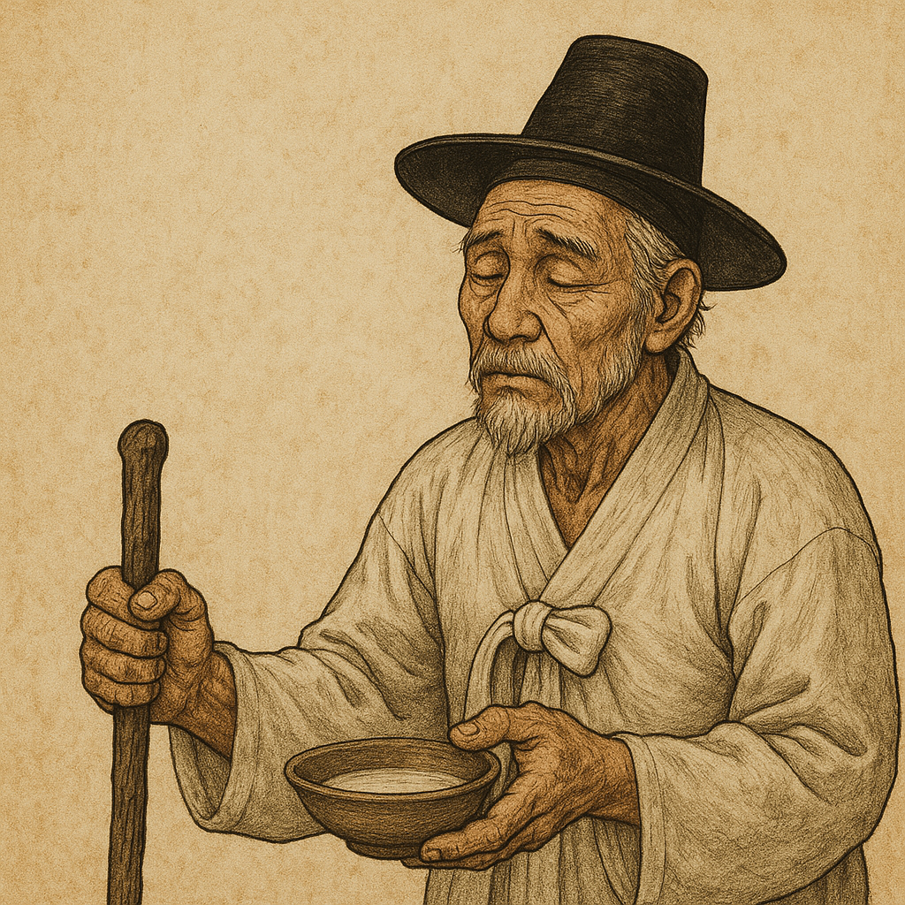

# Simcheongga

Simcheongga is a pansori (traditional Korean narrative music) that tells the story of Sim Cheong, who sacrifices herself by becoming an offering to the sea gods in exchange for 300 sacks of rice to help her blind father regain his sight. After being resurrected and becoming an empress, [Sim Cheong reunites with her father, who ultimately recovers his vision.](https://youtu.be/LrMb2ixf9Eo?si=JtzqMrJYllSxg_rx)
Centered on the theme of filial piety, Simcheongga has been beloved by people of all ages and social classes throughout Korea.
Today, Simcheongga is preserved and performed through various styles, such as the Jeong Eung-min school, the Park Dong-sil school, the Kim Yeon-su school, the Kim So-hee school, and the Park Dong-jin school.
It is highly regarded for its well-organized narrative structure and outstanding dramatic composition.
The first half follows a tragic development leading to Sim Cheong’s death, while the latter half adopts a more humorous and festive tone, centering on Sim Bong-sa (her father).

During the Joseon Dynasty, society was deeply influenced by Confucian values, which strongly emphasized patriarchy. Women were expected to be obedient and filial—to serve their parents and later their husbands. Simcheong embodies this ideal image of a daughter who sacrifices herself for her father.

Her choice to offer herself as a human sacrifice is portrayed as noble and touching. However, in reality, she has little agency in the decision. The story romanticizes female suffering and reinforces the idea that women should endure pain and make sacrifices for others.

Example: In the 2011 French film The Intouchables, the music related to disability appears in the latter part of the film. The main character, Philippe, is a white man who became fully paralyzed after an accident. He falls in love with his female caregiver, and when she leaves, he experiences a deep sense of loss.This situation reminds me of the Korean story of Simcheong, which I previously summarized. In that story, Simcheong’s father, Simbongsa, is blind. He wanders from place to place begging for food in order to care for his daughter. The emotional connection and sense of sacrifice in both stories offer a meaningful point of comparison.[*The lntouchables*](kim_naeun.md)

