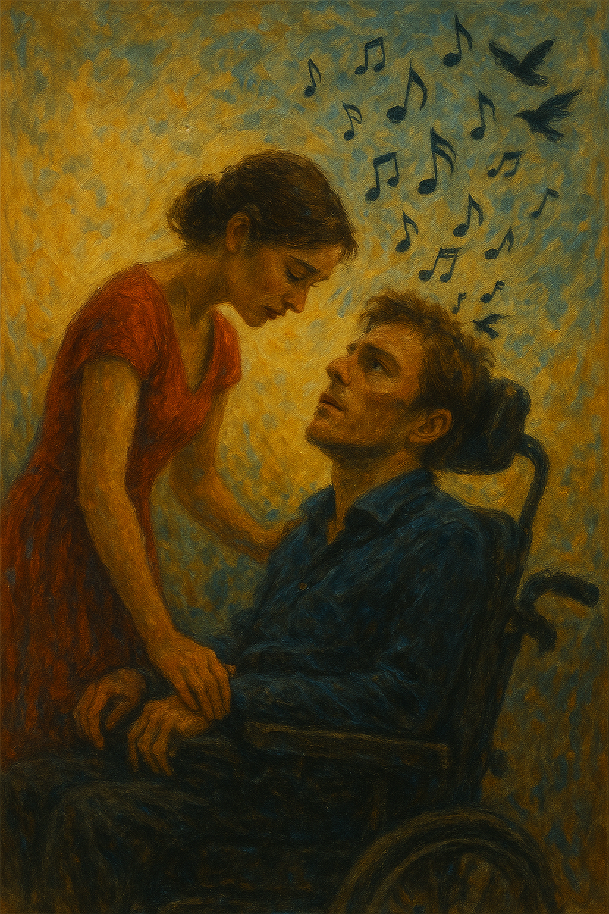

# Me Before You

The film Me Before You portrays the life and choices of Will, a man living with quadriplegia, emphasizing that disability is not merely a physical limitation but a deeply emotional and existential challenge. Will is portrayed as a once-active and ambitious individual whose life is abruptly changed after a motorcycle accident leaves him paralyzed. His struggle stems not only from physical dependence, but also from a deep sense of lost autonomy and identity.
The inserted track, “Not Today” by Imagine Dragons, features a soft, melancholic melody and the repeated lyric “not today,” which effectively reflects the complexity of Will’s inner state. The song begins with a simple acoustic guitar line and gradually builds in texture with light percussion and ambient synths. This gradual layering mirrors the emotional crescendo of the scene in which Will prepares to say goodbye to Louisa and proceed with assisted suicide. The track’s restrained dynamics and circular structure reinforce the emotional push-and-pull—his deep sorrow and his desire to shield Louisa from further pain.
Rather than directly emphasizing physical disability, the music conveys what words cannot: a layered human experience involving loss, longing, love, and farewell. The acoustic instrumentation and Dan Reynolds’ subdued vocals give the piece a human, grounded feeling, enhancing the film’s intimate emotional tone.
Will’s decision to end his life also sparked ethical debates beyond his personal suffering—raising questions about autonomy, the value of life, and how society views disability. In this way, the film, supported by its emotional music, invites reflection not only on personal struggle but also on broader social perspectives regarding life with disability.

A comparable use of music to portray progressive physical disability can be found in [The Theory of Everything](lee_jiseong.md) (2014), which follows the life of physicist Stephen Hawking, who suffered from ALS. The film uses Jóhann Jóhannsson’s soft, atmospheric score to reflect Hawking’s emotional endurance and evolving inner world, much like how Me Before You uses “Not Today” to depict Will’s psychological struggle. Both works emphasize emotional and existential aspects of disability, allowing music to convey what the characters cannot express through physical action.

# 장례식에서 연주되길 희망하는 음악
“[Remember Me](https://www.youtube.com/watch?v=KP_XkN2v7OM&list=RDKP_XkN2v7OM&start_radio=1)” – from Coco (2017)

내가 장례식에서 틀고 싶은 곡은 디즈니·픽사 애니메이션 『코코』의 삽입곡 “Remember Me”이다. 이 곡은 죽음을 다루면서도 슬픔보다 기억과 사랑의 지속성을 강조한다는 점에서 깊은 인상을 준다.
“Remember Me”는 이별의 순간에 "나를 기억해줘"라고 말하는 노래로, 단순하고 반복적인 멜로디와 따뜻한 어쿠스틱 사운드가 조화를 이루며 차분한 위로의 정서를 전달한다. 장례식이라는 자리에서도 이 곡은 무겁지 않으면서도 함께했던 시간의 소중함을 자연스럽게 떠올리게 한다.
내가 이 곡을 선택한 이유는, 나 역시 떠난 이후에도 소중한 사람들의 기억 속에 따뜻하게 남고 싶다는 바람 때문이다. 슬픔에만 머무르기보다는, 나와 함께한 순간들을 떠올리며 편안한 마음으로 이별을 맞이해주길 바라는 마음에서 이 음악이 어울린다고 생각했다.
