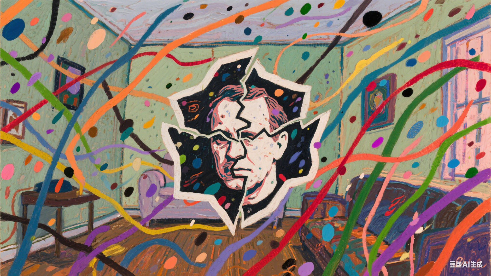

# A Beautiful Mind

This film tells the story of John Nash, a mathematical genius at Princeton University, who proposes groundbreaking theories at a young age. However, as his career flourishes, he begins to suffer from hallucinations and delusions, becoming trapped in a world of his own creation. Nash believes he has been recruited by the government to crack secret Soviet codes, gradually losing the ability to distinguish reality from fantasy. With the support of his family and doctors, he undergoes treatment and, with the unwavering support of his wife Alicia, battles schizophrenia over the years. Eventually, Nash returns to academia and, through his remarkable contributions, is awarded the Nobel Prize in Economics, achieving a legendary life of redemption.

[In one of the film's most memorable scenes! ](https://youtu.be/tvO_78fajxY?si=em-IIRiOn_t_ui1R).,The song's monotonous, repetitive piano melody symbolizes protagonist John Nash’s sense of isolation as he becomes trapped in hallucinations and delusions. The dissonance of the strings highlights his chaotic thoughts and mental instability, while the gradual build-up of the music narratively expresses the worsening of his condition.

The same disease is described in Noh Heekyung's 2014 drama [*It's Okay, Taht's Love!*](do_gwanwoo.md). The drama Davichi's hit song "It's Okay, That's Love"

The song I want to play at the funeral is Deng Yao's [*Farewell Book*](https://www.youtube.com/watch?v=flSg2kEFK1E) . The name of this song is very sad, symbolizing separation, but the melody is indeed cheerful. I also hope that those who attend the funeral will not come with too sad a mood and this song will be my last voice to accompany them through the moment of separation.
