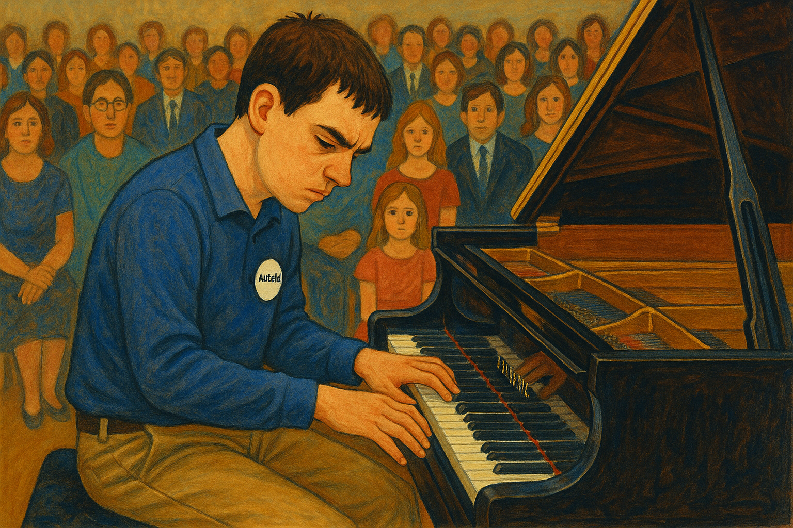

# Keys to the Heart (그것만이 내 세상)

In this film, the protagonist, Intae, has savant syndrome. Savant syndrome refers to a condition in which individuals with brain impairments exhibit extraordinary abilities in specific areas. Intae possesses a genius-level talent for the piano. At the Frederic Gala Concert, he delivers a brilliant performance of Tchaikovsky’s Piano Concerto No. 1. Before he sits at the piano, people laugh at him or whisper behind his back. But the moment he begins to play, everyone's attention is drawn to him. His powerful performance earns a standing ovation and thunderous applause from the audience. 

Tchaikovsky’s Piano Concerto No. 1 begins with a bold, dramatic theme that commands attention and evokes a sense of grandeur and defiance. The concerto is known for its virtuosic demands, intense emotional contrasts, and triumphant climaxes. This performance serves as a powerful symbolic moment that shatters the prejudice of those who had judged him based solely on his appearance before hearing him play.

I thought this work was similar to mine because it also showed how music is used in a story about overcoming and growing. Mamoru Hosoda's 2021 musical [*Belle : The Dragon and the Freckled Princess](huh_yejin.md). The musical Belle's A Million Miles Away

I think I’d play Toy’s “[A Farewell to Remember(뜨거운 안녕)](https://www.youtube.com/watch?v=pBRZzsO3L3o)” at my funeral.
Because I only want people who were truly close to me to be there—
and I don’t want them to be sad.
I hope they can just let go, coolly, and return to their own lives.
The lyrics say goodbye, but the melody isn’t gloomy.
I think that’s the kind of temperature I want in my relationships with people.
