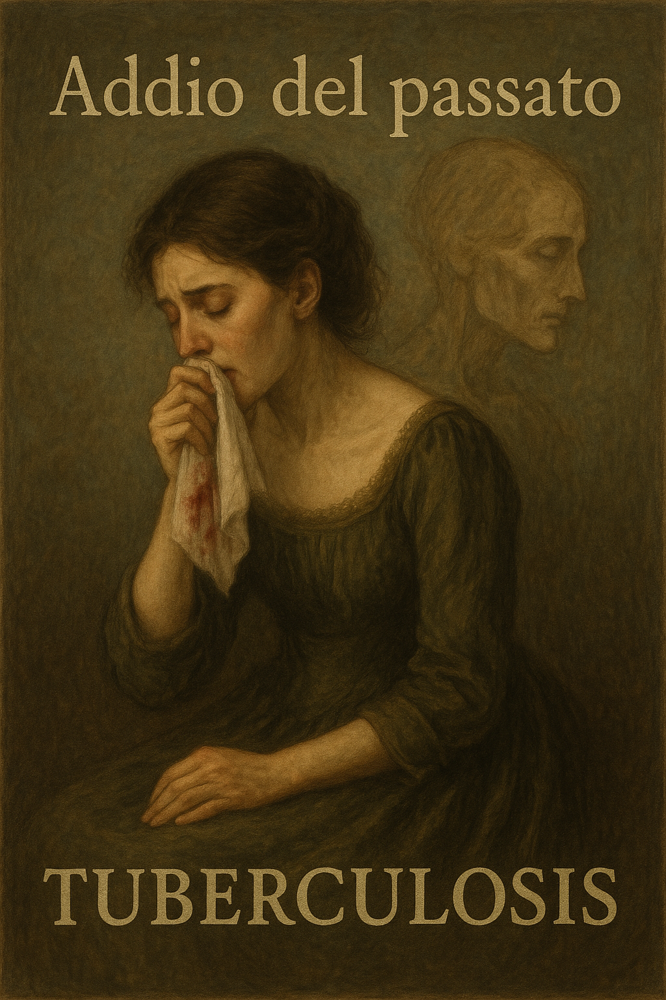

# La traviata

The protagonist of La Traviata, Violetta, is a renowned courtesan in Parisian high society. She falls in love with a noble young man named Alfredo. However, due to Alfredo’s father, Violetta sacrifices her happiness and leaves him. Alfredo misunderstands Violetta’s sacrifice and suffers in despair, but eventually learns the truth and returns to her. By then, Violetta has already lost the will to live and is nearing death, and she dies in Alfredo’s arms.

As Violetta sits in front of a mirror and gazes at her emaciated reflection, she begins to bid farewell to life. [*At this moment,*](https://youtu.be/Do4Ei7Cio2g) she sings a regretful aria titled *Addio, del passato*. Violetta sings, *“Addio, del passato … Ah!… tutto, tutto è finito, or tutto, tutto è finito”* (“Ah! Everything is over, now everything is truly over”), expressing her despair. In the latter part of the lyrics, she further reveals her frailty and loneliness by singing, *“Le rose del volto già sono pallenti”* (“The roses of my cheeks have already faded”) and *“Alfredo perfino mi manca”* (“Even Alfredo’s love is gone from me”). This aria musically expresses her resignation and deep despair toward her life. In other words, Addio, del passato expresses her parting from a once-happy past and the future that will never come.

The theme of bidding farewell to life and love through music also appears in the 2016 film [*Me Before You*](chang_hyomin.md) In the film’s final scene, *Imagine Dragons’ Not Today* captures the emotions of parting from a loved one. The song features a simple chord progression, a narrow vocal range, and a clear verse-chorus structure, with vocals and sound effects conveying a sense of sorrow through a straightforward and calm emotional delivery. Verdi’s opera aria *Addio, del passato* gradually reveals despair and resignation through complex harmonic progressions, fragmented melodic phrasing, dramatic harmonic shifts between minor and parallel major, and flexible rhythmic changes with expressive rubato. Despite their musical differences, both pieces deeply express the emotions of farewell in their own distinct ways.

제 장례식에서 연주되었으면 하는 노래는 가수 *LANY*의 [*if this is the last time*](https://youtu.be/GPbG4mIgKAw?si=8jB3apkeJbmcQ1ES)입니다. 제가 이 노래를 택한 이유는 2가지가 있는데요, 먼저 저는 장례식에서 연주되는 노래는 곧 제가 남기고 가는 마지막 메시지라고 생각합니다. 이 노래는 가족과의 마지막 순간을 앞두고, 지나간 추억의 소중함에 대해 이야기합니다. 노래의 주제가 제가 전하고자 하는 메시지와 일맥상통하였기에 이 노래를 택하게 되었습니다. 두 번째 이유는 노래의 가사 때문입니다. 원래 이 노래의 가사는 가족, 특히 노쇠한 어머니와 아빠에게 작별 인사를 고하는 내용입니다. 그럼에도 불구하고 이 노래를 택하게 된 이유는, 이 노래의 가사를 부모님으로 국한하지 않고, 제 곁에 있었던 소중한 사람들에게 작별인사를 하는 것으로도 해석이 가능하다고 느꼈기 때문입니다. 특히 가사 중 "*If this is the last time, please come close / I love you with all my heart, you know / I don't wanna cry, I'm bad at goodbye*" 부분은, 제가 직접 건네지 못한 작별 인사를 노래가 대신 해 주는 것처럼 느껴져 남은 이들에게 조금이나마 위안이 될 것 같았습니다. 

가영이는 올해 고등학교 1학년이 된 학생입니다. 중학교 동안 부모님의 기대에 부응해 모범생으로 살아온 가영이는 고등학교에서도 역시 부모님의 기대를 충족시키기 위해 좋은 성적을 얻고자 합니다. 그러나 고등학교 공부는 중학교와는 차원이 달랐죠. 모의고사를 하루 앞둔 어느 날, 가영이는 좋은 성적을 거두기 위해 밤새 열심히 공부했습니다. 하지만 너무 늦게까지 공부한 탓에 결국 늦잠을 자고 말았죠. 이 날 이후부터 가영이는 스스로가 한심하게 여기기 시작했고, 종종 심한 불안과 공황 증세가 나타나 숨이 가빠졌습니다. 부모님의 기대를 충족시키지 못했다는 죄책감과 무력감에 휩싸인 가영이는 점차 우울증의 전형적인 증상인 무기력, 자신감 저하, 흥미 상실 등을 경험하기 시작했죠. 이에 어머니는 가영이의 상태가 걱정되어, 딸과 함께 병원을 찾았습니다. 의사가 건네준 문진표에 기계적으로 체크 표시를 하던 가영이는 ‘일 또는 여가활동을 하는데 흥미나 즐거움을 느끼지 못했나요?’라는 문장을 보고 머리를 한 대 얻어맞은 듯한 충격을 받았습니다. 지금은 거의 모든 일에 무관심하고 흥미를 잃은 자신의 모습과는 달리, 공부를 가장 즐기고 잘했던 중학생 시절이 떠올랐기 때문입니다. 병원 진단을 통해 우울증임을 확인한 가영이는 이후 자신의 상태를 받아들이고, 치료와 상담을 시작했습니다. 이제 가영이는 약물 치료와 심리 상담을 병행하며, 일상의 사소한 것들에서부터 다시 즐거움을 찾아가고 있습니다.

[플레이리스트](https://music.youtube.com/playlist?list=PL1eiBxuVGVemq17MemXx8rZHLCUJFQhZy)
