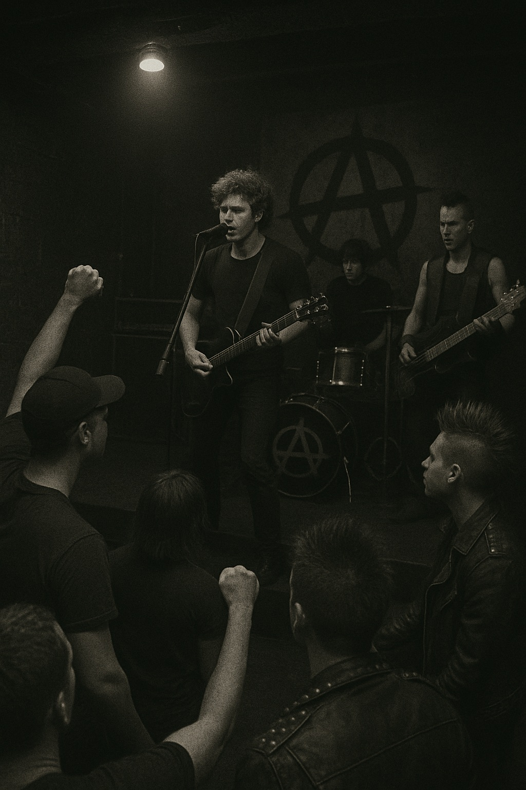

# True biz
This novel, written by a deaf author and featuring a deaf main character, offers a vivid portrayal of deaf culture. Charlie, the protagonist, who had always believed she misunderstood music, begins to connect with it by feeling the anarchist punk music of her friend’s band through her heart. Ironically, she finds she can experience the music more deeply when she turns off the cochlear implant her mother forced her to wear in an attempt to make her live like a hearing person. Through Charlie—who grew up under an ableist society and was later sent to a deaf school—we witness not only the systemic ableism and the shortcomings of medical approaches to disability, but also the historical struggles and racial issues within American deaf culture.

The same disability is described in Sian Heder’s 2021 film [*Coda*](han_gahyeon.md) and Cho Sunho’s 2024 film [*Cheongseol(Hear Me)*](lee_yewon.md). In contrast to the novel, which deliberately avoids using music to reflect the perspective of Charlie, these works use music to highlight the main theme, deafness.

#내 장례식에서 연주되길 희망하는 음악
이민휘의 [*미래의 고향*](https://youtu.be/DsgUXd5J688?feature=shared)

기본적으로 나는 내가 죽은 다음에는 뭘 하든 상관없다고 생각한다. 하지만 나 때문에 열리는 행사에 내가 노래를 틀어야 한다면, 내가 좋아하는 노래를 고르는 것이 맞을 것이다. 마침 알맞게 슬픈 분위기이기까지 한 이민휘의 미래의 고향은 같은 제목인 포크 앨범의 마지막 곡이자 타이틀곡이다. 다른 악기 소리가 거의 없이 전면에 나선 이민휘의 목소리는 집중하게 만드는 힘이 있다. 공기가 섞인 소리가 관악기 같기도, 부드럽게 이어지는 현악기 같기도 하다. 오묘하게 대상 없는 그리움을 자아낸다. ”우리는 우리를 우리라고 부를 수도 있을까“, “서로를 스칠 때 같은 노래를 부르지” 같은 가사들은 만남에 대해 이야기하고 “오늘 부르는 노래는 내일 부를 노래” 같은 가사는 미래를 암시하는 듯하다. “같은 노래”를 부른 “우리”를 떠올리는 데에 가장 좋은 노래일 것이라고 생각한다.
장례식에 오래 있을 사람의 지루함까지 고려한다면 앨범 전체를 틀 수도 있을 것이다. 조금 더 유머러스함을 가미할 수 있다면 이민휘의 다른 앨범에 더해 그가 참여했던 밴드인 무키무키만만수의 실험적인 음악을 추가하겠다.
