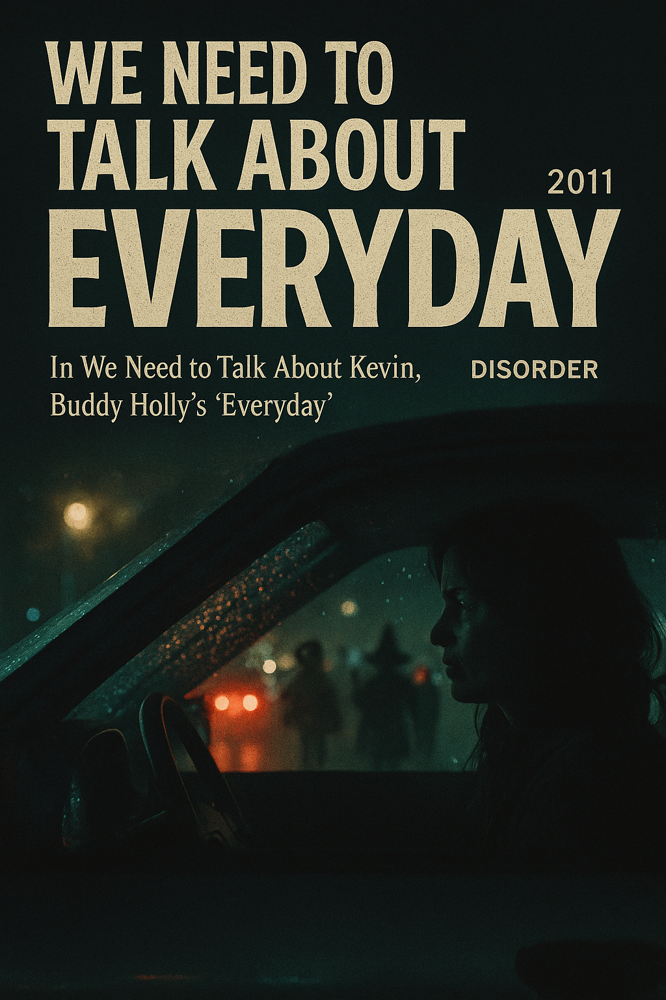

# We Need to Talk About Kevin

In We Need to Talk About Kevin, Buddy Holly’s "Everyday" plays during a haunting Halloween night scene, where Eva drives home through dark, rainy streets filled with children in costumes. The song’s lighthearted melody stands in stark contrast to Eva’s tense expression and the eerie visuals of blurred headlights and wet glass, capturing her inner turmoil and growing dread. The camera mirrors her anxious gaze, turning ordinary suburban sights into sources of fear.

This ironic pairing of upbeat music and psychological distress reflects the film’s central tension between surface normalcy and hidden violence. Rather than providing emotional relief, ["Everyday"](https://www.youtube.com/watch?v=l2Nk-TVuthE) intensifies the discomfort, emphasizing Eva’s alienation and the fragility of routine in the face of trauma.

Example: The similar hardship is described in Alban Berg's 1925 Opera [*Wozzeck*](jang_geunyeong.md). Both works use music to reveal the hidden nature of mental illness, contrasting surface normalcy with underlying psychological collapse.

