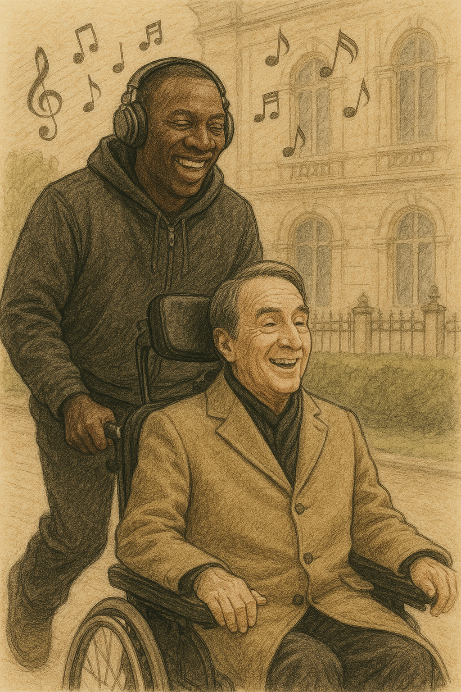

# Untouchable

Ludovico Einaudi's Fly delicately depicts the fragility of human existence and the strength that overcomes it through repetitive patterns and gradual ascents without directly explaining illness or disability. The simple and gentle piano melody that begins gently approaches as if to carefully embrace life again, and the gradually increasing rhythm carefully builds up the will to overcome physical limitations. This song appears in the movie Untouchable when Driss drives a car through the city with Philippe in a wheelchair. [The camera focuses on the two people in the fast-moving car, and the light yet delicate rhythm of Fly fills the background, momentarily forgetting about their disability and enjoying freedom, further highlighting the laughter and sense of being alive.](https://youtu.be/kYiIsoMVQCY?si=lKGutVNQBCU8gxVj) Therefore, this music does not express sadness or sympathy, but quietly but powerfully shows the light flight of the human spirit that overcomes disability and runs through life.

The same disease is described in Thea Sharrock’s 2016 film [*Me Before You*](kim_minjung.md). Me Before You and The Intouchables both revolve around the lives of quadriplegics, but they differ greatly in how they portray and deal with the disease. Will in Me Before You becomes paralyzed from the neck down after a motorcycle accident, loses his will to live, and decides to commit assisted suicide. He briefly finds hope through his relationship with his caregiver, Louisa, but ultimately chooses to take his own life. On the other hand, Philippe in The Intouchables becomes paralyzed from the neck down after a paragliding accident, but he regains his vitality after meeting his free-spirited caregiver, Driss, and he accepts his disability through humor and human relationships. Both films realistically portray the physical difficulties of quadriplegic life, but they convey contrasting messages: Me Before You is emotional and tragic, while The Intouchables looks at the disease from a bright and cheerful perspective.

# 나의 장례식에선 나왔으면 하는 노래

나의 장례식에서는 [드뷔시의 달빛](https://youtu.be/xl6qDlPCTUM?si=1e96L6h_RLVzX2eG)이 흘러나왔으면 좋겠다. 드뷔시의 ‘달빛’을 장례식에서 틀고 싶은 이유는, 이 곡이 지닌 고요하고도 깊은 아름다움이 이별의 순간을 조용히 감싸 안아 줄 것 같기 때문이다. 슬픔을 억누르거나 과장하지 않고, 마치 달빛처럼 잔잔하게 마음에 내려앉는 이 곡은 사랑했던 사람을 떠나보내는 데 있어 말보다 더 진한 위로가 될 수 있다고 느낀다. 곡이 흘러나오는 동안, 고인의 삶을 돌아보며 애도와 감사의 마음을 차분히 전할 수 있을 것 같다.

