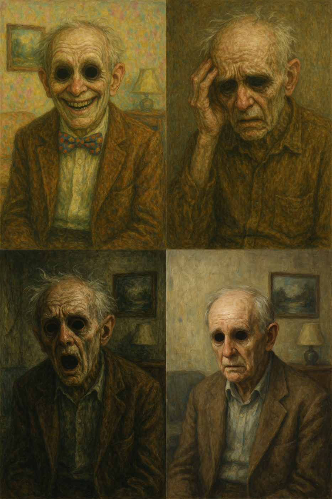

# Everywhere at the end of time

Everywhere at the end of time is a six-part album series created by The Caretaker, centered around the experience of dementia and the gradual deterioration of memory. The album sonically depicts the emotional and psychological decline over time, with each stage representing a different phase of cognitive decay. In Stage 1, nostalgic and warm ballroom music from a distant past plays, lightly distorted by subtle noise and looping to hint at the earliest signs of memory fading. By Stages 2 and 3, the melodies begin to warp and blur, immersing the listener in a growing sense of confusion and cognitive decline. In Stage 4, dissonance and chaotic soundscapes dominate, representing the fragmentation of reality and memory, causing the listener to feel a profound sense of helplessness and disorientation. Stage 5 descends into nearly unrecognizable fragments and overwhelming noise, illustrating the near-total loss of coherent memory where only meaningless remnants remain. Finally, Stage 6 unfolds into near silence and dissolution, capturing the total cognitive collapse and the lonely emptiness left behind at the final stage of dementia.

In order to express mental breakdown, mental illness, confusion, and uncertainty, we can see that many difficult-to-listen-to musics, such as the 12-tone technique that appears in [wozzeck](jang_geunyeong.md), that are outside the existing harmonic system are used. The characteristic of this work that is in contrast to Wozzeck is that it is electronic music, so there is intentional noise and sound.

Links to each stage  
[Stage1](https://www.youtube.com/watch?v=wPOF5FgG3DU&list=OLAK5uy_mojBy7gXjbb-DCXjYCTWz1lp30IcEeZMQ)
[Stage2](https://www.youtube.com/watch?v=I-xn5w8VXVQ&list=OLAK5uy_kz9wNQpu4cF3awH9pilOd_pkwhrbEE1xM)
[Stage3](https://www.youtube.com/watch?v=ca6R3qfmN5U&list=OLAK5uy_k4s7OrxbRBis9ArGFvXjC19ZyGe8HuGOA)
[Stage4](https://www.youtube.com/watch?v=QlqHpMdO2vc&list=OLAK5uy_lNfBJWbS2njoIiW802Gbcy94ljo37bS8E)
[Stage5](https://www.youtube.com/watch?v=wCIFWLWxHwM&list=OLAK5uy_kaRq_IjkSYoPmqR5eHQ7-erevT8IMFJYA)
[Stage6](https://www.youtube.com/watch?v=hNY4putr7-I&list=OLAK5uy_kk5jHTM05i-WrK41Mlk2wW2WwYyPbcS8A)

Music to be played at my funeral  
It is foolish to worry after death. But I like foolishness. Because it is a true heart without lies. I don't think I will die before my parents and my older sister, unless there is a disaster. Even if that happens, it will not change anything. I hope my death does not bring about any change in others. It is not that I want no one to be sad about my death. I just hope that the sadness does not have any more meaning. In that context, the song "Boy Reside Ahead Of Girls University"[(여대 앞에 사는 남자)](https://www.youtube.com/watch?v=rQUHVDb57uU) by Yoon Seok-cheol Trio will be played at my funeral. It has no particular meaning. I hope that it continues to move like fingers on a piano.

Disease narrative and playlist  
When I woke up one morning and drank a sip of water, I felt an unpleasant foreign body sensation in my throat. At that time, I thought that if I took a handful of anti-inflammatory drugs, it would get better. I should open my throat and pour or extract the anti-inflammatory powder on the inflamed area. I should sleep again and wake up, and it would be completely healed. All I could say was how to make this pain go away, and I couldn't do anything about the pain itself. I swallowed a Tylenol that I had as a regular medicine. The pain was worse than when I first swallowed it. Then I lay down again and closed my eyes, and I kept swallowing dry spit. I thought avoiding the pain was the normal choice, but I kept swallowing dry spit. I don't know why I kept doing that, because I couldn't tell or know that feeling the pain again would change anything. The stupidity stopped not because I realized that I had to stop this stupidity, but because I became hazy from the medicine. The pain got worse after I woke up. 
I woke up on the phone ringtone. Honey, my voice is different from usual. I found the water by answering the phone. I feel very painful while drinking water in bottled water. As the idea that 'something is wrong' spreads through the nerves, I learned that my head, arms, legs, nasal cavity, and inflammation of the neck belong to me. I definitely remember who the phone came to and what went. But it wasn't important at all. It is the same if someone's objections or sins are not remembered. It wasn't important at all, and there's only a pain that I didn't know when it would start again, when I was taking a step in front of my neck. I had a saliva in my mouth. I couldn't do it except spit. 

The heat came up and my whole body was so sad. I don't have this experience before. It hurts and healed greatly, and I have experienced that experience several times. But again. I thought I would die. And when I thought about it, I thought that death no longer depends on me. Think about it. For a healthy person, death can be a problem of choice. You can think about dying and you can move into action. But sick people are often different. The sick is a matter of choice. If you do nothing, the healthy is old, but the sick die. I didn't want to smoke and swallowed up something, and all the desires were gone. 

I decided to do nothing once. I really wanted to do nothing. I had a towel in my mouth and stunned the ceiling for 13 hours.  
Here is a playlist of the story: [here](https://www.youtube.com/playlist?list=PLWVjJ32KxG1mQiep20fepT3ZQ9lXZ1hmB)
