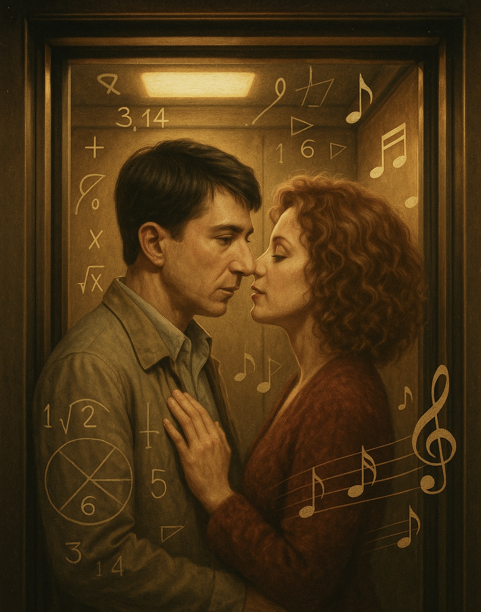

# Rain man

The emotional moment in the elevator where Raymond (Dustin Hoffman) and Susanna (Valeria Golino) dance and express their emotions further enhances the emotional atmosphere of the film. 

[In one of the film's most memorable scenes](https://www.youtube.com/watch?v=JUwa6ZkHtnY), the two characters listen to music and the protagonist, Raymond, who suffers from savant syndrome, experiences love with a woman for the first time in his life.

Example: The same disease is descriebed in jeong yoon-cheol's 2005 movie [*run, chowon*](kim_taehyeong.md). The film deals with the same automism. However, while the main character is connected to outsiders in the film Rain Man, the main character is becoming more isolated in run, chowon.

