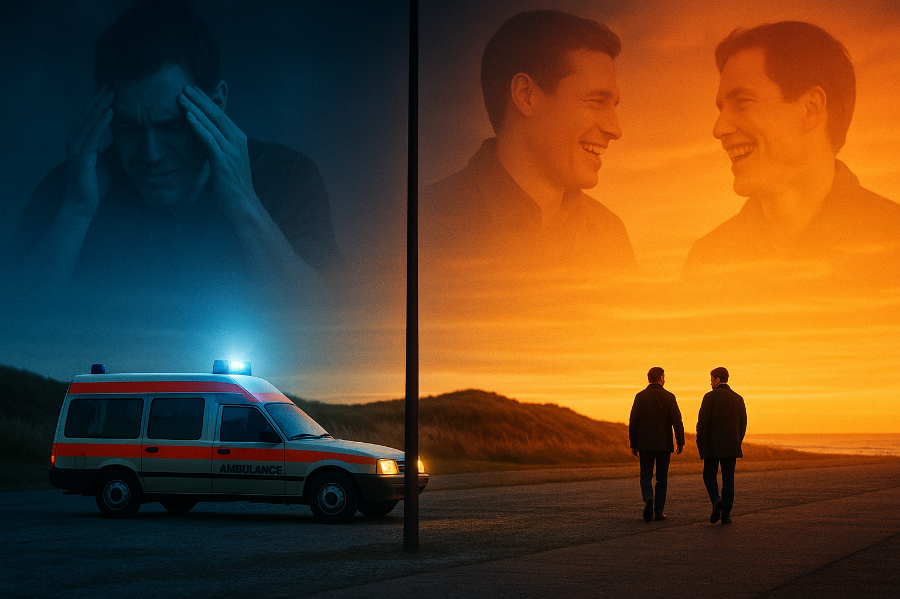

# Knockin' on Heaven's Door

 In *Knockin' on Heaven's Door*, the two main characters, Martin and Rudi, are diagnosed with terminal illnesses — Martin with a brain tumor and Rudi with myeloma. By chance, the two shared the same hospital room, and they decide to go on a journey together to do the things that they had never had before. They shared many joyful moments and unforgettable experiences, but as Martin’s seizures grew more severe, they came to realize that their time was running out — and so they set out to fulfill their final wish: to see the ocean. While enjoying vodka and cigarettes, [they finally arrive at the long-awaited ocean](https://youtu.be/Rd-ru-j_TCI?si=ACK4zsul577yWhzW). The two silently gaze on the sea. Suddenly, Rudi suffers a seizure and passes away. Martin stares blankly at his friend, then quietly lets him go. The final scene shows Martin accepting his own approaching death calmly, as Rudy did,  a peaceful embrace of mortality, creating a lingering impact.
 
 The original song was featured in the 1973 film *Pat Garrett and Billy the Kid*, directed by Sam Peckinpah. In *Knockin' on Heaven's Door*, a cover version, by the German rock band Selig, was used with greater emphasis on the band's instrumentation and performed in a lower key compared to the original. The first verse is sung solely by the vocalist, and from the second verse onward, a chorus joins in, similar to the original version. In the refrain, the lyrics "knock knock knockin' on Heaven's door..." keeps continue, effectively conveys the protagonists' gradual descent toward death and enhancing the lingering emotion of the ending.
 
Example: The story portrays a narrative similar to [*Bohemian Rhapsody*](kwak_junyeong.md), in that the character continues to suffer from illness but does not despair over their situation. Instead, they persistently strive to achieve their goals without giving up, even if they know that they will die in suffer.

