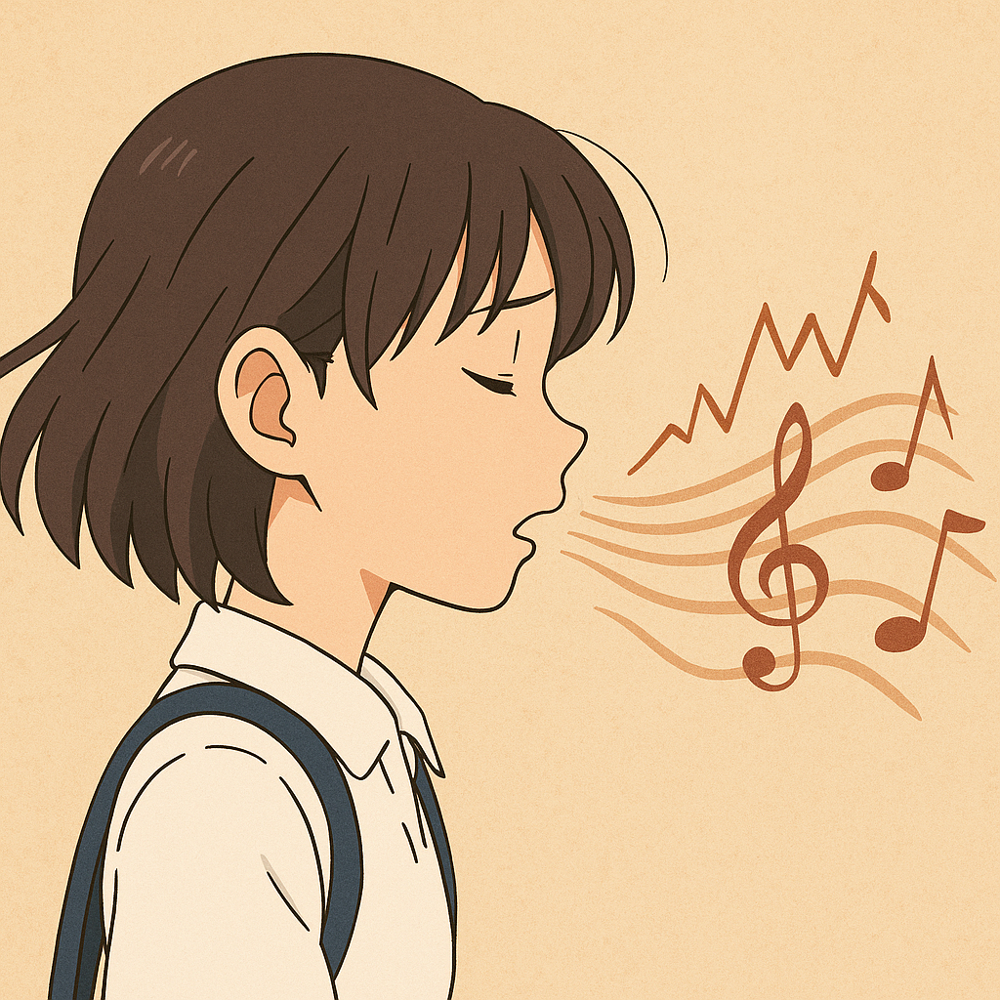

# A Silent Voice

In animation, voice serves as a crucial medium for revealing characters' inner states, while music tangibly articulates illness and disability. The film follows Shoya, a former bully who seeks redemption by reconnecting with Shoko, a deaf girl he once tormented. As their relationship gradually evolves from guilt to fragile understanding, the film uses sound and silence to mirror their emotional shifts. In A Silent Voice, unstable rhythms and fractured melodies reflect psychological anxiety and isolation, and the tremors in vocal expression deepen the audience's sensory understanding of the character’s pain. Notably, [the song 「恋をしたのは」 (Koi wo Shita no wa)](https://www.youtube.com/watch?v=sAzNLC1Lu7Q) enhances this depiction, supporting the protagonist’s emotional arc by conveying longing and vulnerability in moments where verbal communication falters. While the voice plays a powerful expressive role, the film also subtly acknowledges its limitations within the context of deafness. Rather than portraying hearing loss as mere absence, the work suggests an alternative sensory richness—what some describe as "Deaf gain"—highlighting how different modes of perception can reshape narrative and empathy.

Example: The same disease is described in Agnieszka Holland's 2006 film [*Copying Beethoven*](yoo_kyeongsoo.md). The film L.V.Beethoven's hit song "L.V.Beethoven Symphony No.9 in d minor op.125"

나의 장례식에서 연주되길 희망하는 곡은 [Chopin: Scherzo No. 2 in B Flat Minor, Op. 31](https://youtu.be/OCUSalQf-jY?si=wvgbHsw-X0hcS-of)이다. 12살에 알게 되어 지금까지도 자주 듣는 이 곡은 나를 가장 잘 표현하는 음악 같다. 시작부터 쏟아지는 강렬한 포르테 화음은 어린 시절 방황하던 나의 모습과 겹쳐 보인다. 곡의 흐름을 따라가다 보면, 역경과 고통이 존재할지언정 나는 나의 생각과 목소리를 잃지 않는다. 그리고 끝내 그것을 밀고 나가 내 방식대로 희망에 도달해내는 이야기처럼 들린다. 단순한 해피엔딩과는 다르다. 이 곡은 단조에서 시작하여 장조로 마무리되는 것이 특징이다. 이는 치열하게 내 소신을 밀어붙인 끝에, 내가 말해온 희망에 닿게 되는 승화의 여정처럼 느껴진다. 나와 인생의 절반을 함께하고, 앞으로도 인생의 대부분을 함께하게 될 이 곡이 내 인생의 피날레를 장식해주었으면 한다.
