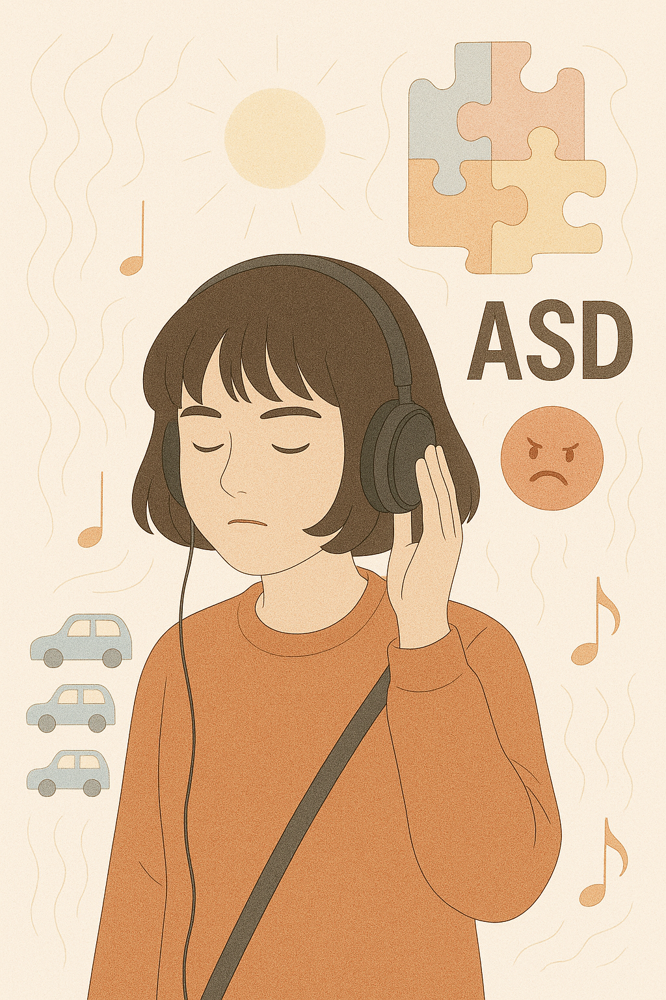

# Extraordinary Attorney Woo(이상한 변호사 우영우)

"[A Whale in a Frame](https://youtu.be/DTsk6VNO9Wk?si=FNQt0Qsv3E2vX50n)" expresses the structural and order-oriented mindset of autism spectrum disorder through regular and repetitive piano rhythms, and the delicate development of string instruments that gradually accumulate indicates that Woo's emotions are not revealed but are expanding deep and complex inside. In addition, the dreamy and underwater-inspired sound texture symbolizes Woo's immersion and sensory excess when she thinks of whales in her imagination, and delicately reflects Woo's inner self, who is sensitive to stimuli and maintains her own rhythm and world by maintaining tension and concentration without dramatic changes in the entire music.
Additionally, this music can be seen in episode 4 when Woo Young-woo is emotionally focused while looking at a whale painting.

Example: The same disease is described in Barry Levinson's 1988 film [*Rain Man*](ahn_ire.md). The film Hans Zimmer's song "Leaving Wallbrook - On the Road".

---

# 장례식에서 연주되길 희망하는 음악

[쇼팽 - 에튀드 "나비" (Chopin Etude Op.25 No.9)](https://youtu.be/_ATFtPs9ZlQ?si=uH6H1c9JpNeGwm3v)

쇼팽의 '나비 에튀드'는 오른손의 빠르고 불규칙한 도약, 가볍고 튀는 스타카토, 그리고 소리를 부드럽고 자연스럽게 이어주는 페달 사용을 통해 나비의 섬세하고 자유로운 날갯짓을 음악적으로 그려낸다. 나비가 죽은 이의 영혼을 상징한다는 미신처럼 이 곡을 들은 사람들이 내가 나비처럼 하늘을 가볍게 떠도는 모습을 떠올릴 수 있을 것이라 생각하기에, 나는 내 장례식에서 이 곡이 연주되길 바란다.

Chopin's "Butterfly Etude" portrays the delicate and free winging of a butterfly musically through the fast and irregular leaps of the right hand, light and bouncing staccato, and the use of pedals that connect sound smoothly and naturally. I hope it will be played at my funeral because I think people who listen to this song will be able to think of me floating lightly in the sky like a butterfly, like a superstition that a butterfly symbolizes the soul of a dead person.
