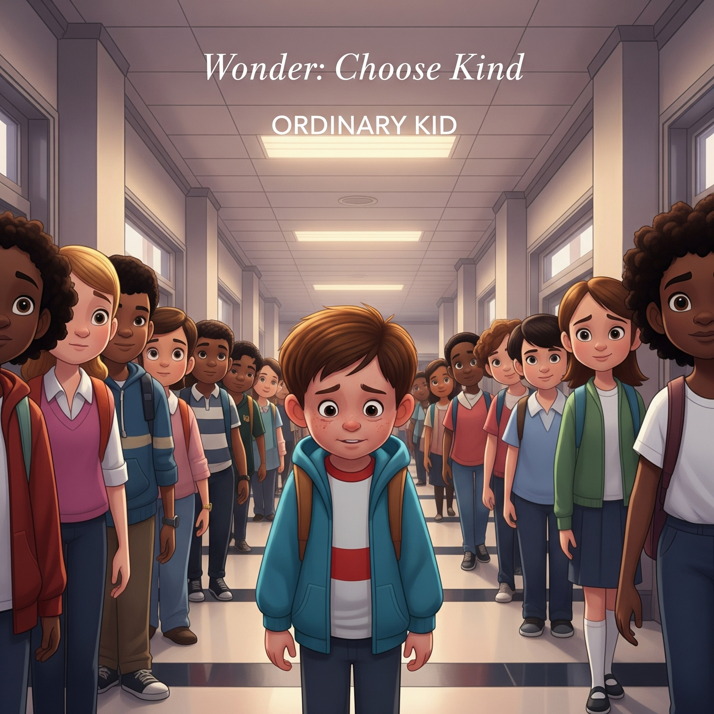

# wonder

["Ordinary Kid"](https://youtu.be/CT69UaBUydA?si=qt6t0Xb1kGwNrp_u) highlights the movie's core message, 'The Ordinary Kid,' and musically expresses Auggie's inner world and emotions. It is used as the background for Auggie's birth and surgical scenes. Fast-changing chords and repetitive melodies symbolically represent the tension of the moment Auggie was born,Auggie's inner conflict and growth process.

In this piece, rapid chord changes reflect the inner turmoil, anxiety, and shifting emotional states that Auggie experiences. Though he longs to be an “ordinary kid,” his appearance creates an invisible wall between him and the world. The early section of the music features a simple, repetitive melody, mirroring Auggie’s everyday but unstable psychological state.

As the piece moves into the middle section, the harmony gradually evolves, and strings and woodwinds are introduced, adding emotional depth. This progression symbolizes Auggie’s journey toward forming relationships and gaining confidence. Through his friendship with Jack Will, he begins to experience social connection, and the music expresses the expansion of his emotions and inner growth.

In the latter part of the piece, the melody steadily rises, with more instruments joining in harmony, building toward an emotional climax. This section reflects the moment Auggie begins to truly accept himself and recognize his own worth. As he overcomes challenges at school and starts to carve out his own path, the music becomes a metaphor for emotional liberation and self-acceptance.

No longer trapped in repetition, the melody now stretches outward, conveying a sense of forward motion and personal discovery. It symbolizes Auggie’s embrace of his uniqueness and the establishment of his identity.

The similar disease is described in Michael Gracey’s 2017 film [*The Greatest Showman*](shin_minchul.md). The film’s song is “This Is Me”. It is similar in that it is a movie about people with physical deformities such as dwarfism, gigantism, and albinism. Another similarity is that the music in both films expresses the protagonists’ inner growth.

The piece I would like to be played at my funeral is Edvard Grieg’s ["“Morning Mood,” Op. 46 No. 1."](https://youtu.be/g2-a63dCPT0?si=fDrtKnoybSSC_R_q)
From the very beginning, the music conveys a sense of morning that feels pure and familiar to everyone. It beautifully captures the feeling of crisp, early dawn air—a piece I often listened to when I couldn’t sleep.

If this music were played at my funeral, I believe it would make the moment feel less like the end of a life and more like the beginning of another—like the start of a new day. Around the one-minute mark, the melody gradually intensifies, as if expressing a life lived with passion and purpose. Then, as the piece gently winds down, it seems to whisper a quiet farewell while hinting at a new journey beyond this life.

More than anything, this music brings peace to those who listen. I hope that, for those mourning my passing, it will offer comfort and a gentle sense of calm.

