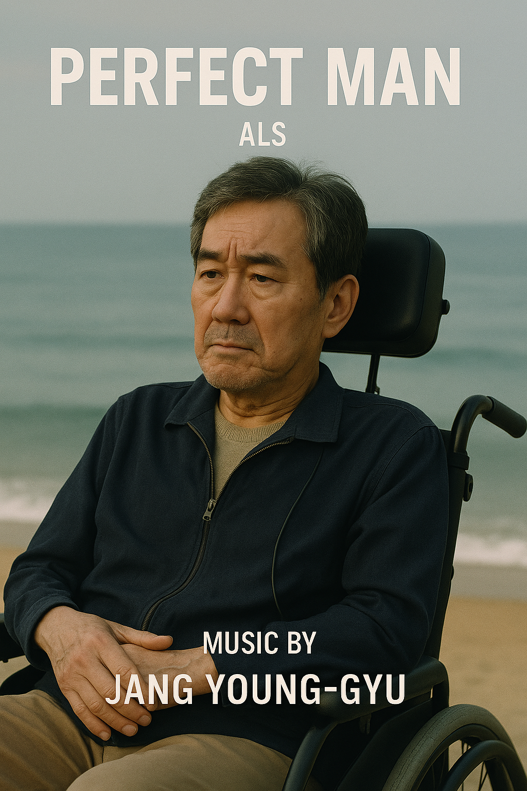

# Perdect Man

“Perfect Man” is a South Korean film directed by Yong Soo, which tells the story of Jang-su (played by Seol Kyung-gu), a middle-aged man diagnosed with ALS (Amyotrophic Lateral Sclerosis). The film delicately portrays his emotional journey as he faces the gradual breakdown of his body. ALS is a progressive neurodegenerative disease in which motor neurons in the brain and spinal cord deteriorate over time, leading to muscle paralysis. As the disease advances, it affects speech, swallowing, and eventually breathing, while cognitive functions remain intact. This cruel progression brings intense physical suffering alongside emotional isolation and despair.

[In the film Perfect Man, the music](https://youtu.be/Ps9Fcg8u7X0?si=nf2GGk-g--54y2Nb) used effectively reflects the protagonist’s emotional transformation as his illness progresses. Composer Jang Young-gyu conveys this painful reality and emotional turbulence through a poignant, orchestral-based score. His music highlights the protagonist’s psychological shifts as the disease unfolds. A particularly striking example is the scene in which Jang-su receives his terminal diagnosis and quietly stares out of the hospital window. The subdued piano melody and sustained string harmonies in this moment express the weight of his shock, loss, and solitude without any words being spoken. Later, in a scene where Jang-su visits the seaside with a friend despite his worsening condition, the music becomes warmer and more uplifting. The bright piano theme paired with gentle string accompaniment highlights the value of connection and fleeting hope even in the face of death. Jang Young-gyu’s score closely follows the protagonist’s emotional trajectory, subtly enhancing moments of fear, acceptance, and longing. Ultimately, the music in Perfect Man functions as more than just background—it serves as an emotional narrator revealing the human depth behind the physical toll of illness. Through carefully crafted melodies, it gives voice to the silent struggle of living with ALS, portraying not only despair but also resilience and the dignity of holding on to hope.

The same disease, ALS, is portrayed in the 2014 film [*"The Theory of Everything"*](zhang_yuwei.md). Both the 2019 South Korean film *"Perfect Man"* and *"The Theory of Everything"* focus on the physical decline and inner struggles of ALS patients, using music to deeply express the protagonist’s pain, hope, and emotional transitions. Both films utilize piano and string instruments to intertwine despair and hope, effectively drawing the audience’s empathy, highlighting their clear connection.

