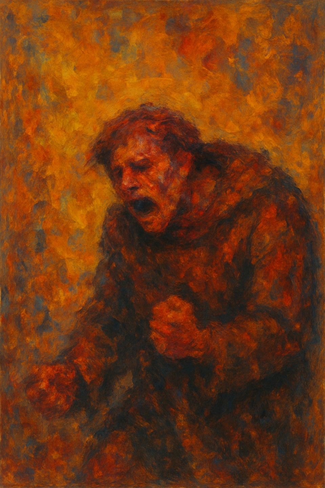

# Notre-Dame de Paris

 In the song [*Dieu que le monde est injuste*](https://www.youtube.com/watch?v=puzRBbqC1qI), Quasimodo—a man condemned to solitude and scorn because of his physical deformity—emerges as a deeply human and tragic figure, full of hidden tenderness and pain. Despite his grotesque exterior, he possesses a pure heart and a desperate yearning to be loved and seen as equal.
 
 The refrain “Ah ! Dieu ! que le monde est injuste” (“Ah, God, how unfair the world is”) expresses Quasimodo’s outcry against the injustice he faces due to his physical disability. As a recurring line, it forms the emotional core of the piece. The phrase “Mon visage est un masque” (“My face is a mask”), which appears in the middle of the first verse, symbolizes the pain of having to hide his true self because of his grotesque appearance. “Je me sens seul” (“I feel alone”), found in the second verse or the bridge, reveals Quasimodo’s deep sense of isolation. The line “Pourquoi faut-il que je souffre ainsi ?” (“Why must I suffer like this?”), which appears just before the climax, highlights the anguish of a person whose very existence is denied.

 On stage, the actor portraying Quasimodo uses a hunched posture, twisted gait, and withdrawn movements to represent his physical pain. A rough and coarse voice is used to depict his external affliction, while a soft and expressive singing tone contrasts this by conveying his inner purity. The music begins softly and gradually intensifies, expanding Quasimodo’s suffering beyond physical pain into a broader expression of protest against injustice. At the climax, the despair of being denied as a human being and the suppressed longing erupt powerfully, effectively communicating Quasimodo’s pain to the audience.

A similar disease, ALS, is described in the film [*The Theory of Everything*](kim_minju.md). The disease is portrayed through Die Walküre Act 1 – Vorspiel and Götterdämmerung – Siegfried’s Death and Funeral Music.

[*John Lennon - Love*](https://www.youtube.com/watch?v=MUTz3LQEq1Q&list=RDMUTz3LQEq1Q&start_radio=1)

The song I would like to be played at my funeral is [*"Love" by John Lennon*](https://www.youtube.com/watch?v=MUTz3LQEq1Q&list=RDMUTz3LQEq1Q&start_radio=1). It’s not my favorite song, but it’s the one I most want to share with others. That’s because its lyrics are deeply meaningful to me. There’s no elaborate language or grand statements—just a quiet, simple repetition that, to me, gently holds the essence of love. I hope that those attending my funeral will listen to this song and go on to live their days with a little more love in their hearts.
