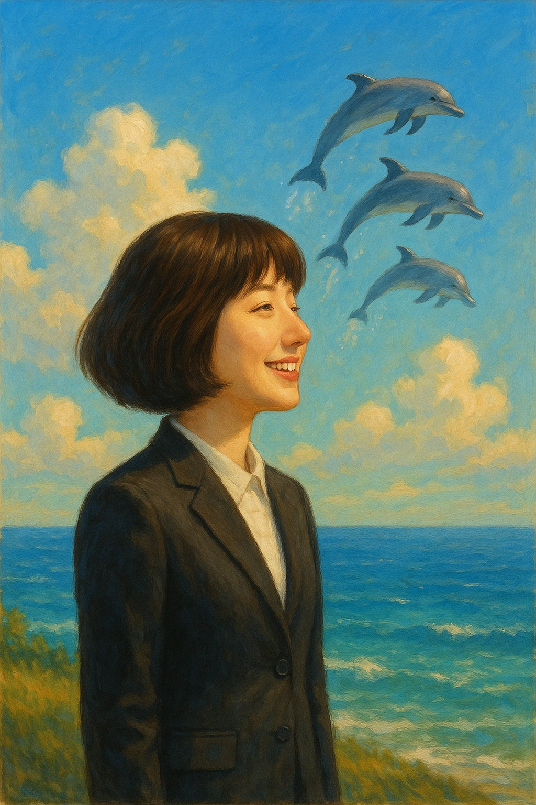

 # Weird lawyer Woo Youngwoo

 Having a genius brain and autism spectrum at the same time, Young-woo is quirky and out of the blue, but solid, straight and energetic. "Imagination" is the source of Young-woo's careful steps forward without stopping at his own pace. This song invites everyone to the blue imagination that goes beyond their thoughts and limits. This song allows us to be with this imagination that supports Young-woo and imagines a more transparent and clear world.
[The song is a musical composition of Woo Young-woo's inner world and emotions, especially depicting the experiences of people with autism spectrum disorder in detail.](https://youtu.be/LPZDKf29IRs?si=cRknNqy3tArdMYDo) Through this song, music director Noh Young-sim said he wanted to convey "a comfort to everyone who tries to communicate and live with people in the world." This is a musical expression of the difficulties of communication experienced by people with disabilities and their desire to connect with the world despite this.
 
Example : The same disease is discribed in In Shik Yoo's 2022 drama [*Weird lawyer Woo Youngwoo*](park_hyowon.md). A hit song from the drama "Weird Lawyer Woo Young-woo” is Beyond My Dreams.

 
지킬앤하이드 <Take Me As I Am>
내 인생을 바꾼 가장 감명깊었던 뮤지컬에, 가장 좋아하는 넘버다. 이 넘버는 지킬 박사가 자신의 위험한 실험에 몰두하기 직전, 엠마와 미래에 대한 다짐을 나누는 장면에서 부른다.
둘은 서로에 대한 믿음과 사랑을 노래하며, "있는 그대로의 나를 받아줘"라는 메시지를 전한다. 이 곡은 엠마가 지킬의 고뇌와 불안정을 이해하고 수용하겠다는 사랑의 서약이고, 지킬은 그런 그녀에게 감사를 표현하며 “내가 어떤 모습이든 너만 믿고 가겠다”는 다짐이 담겨 있다. 

(https://youtu.be/DbBwlKmkZ1s?si=5RTrOvpP8_Q3w_TE)
