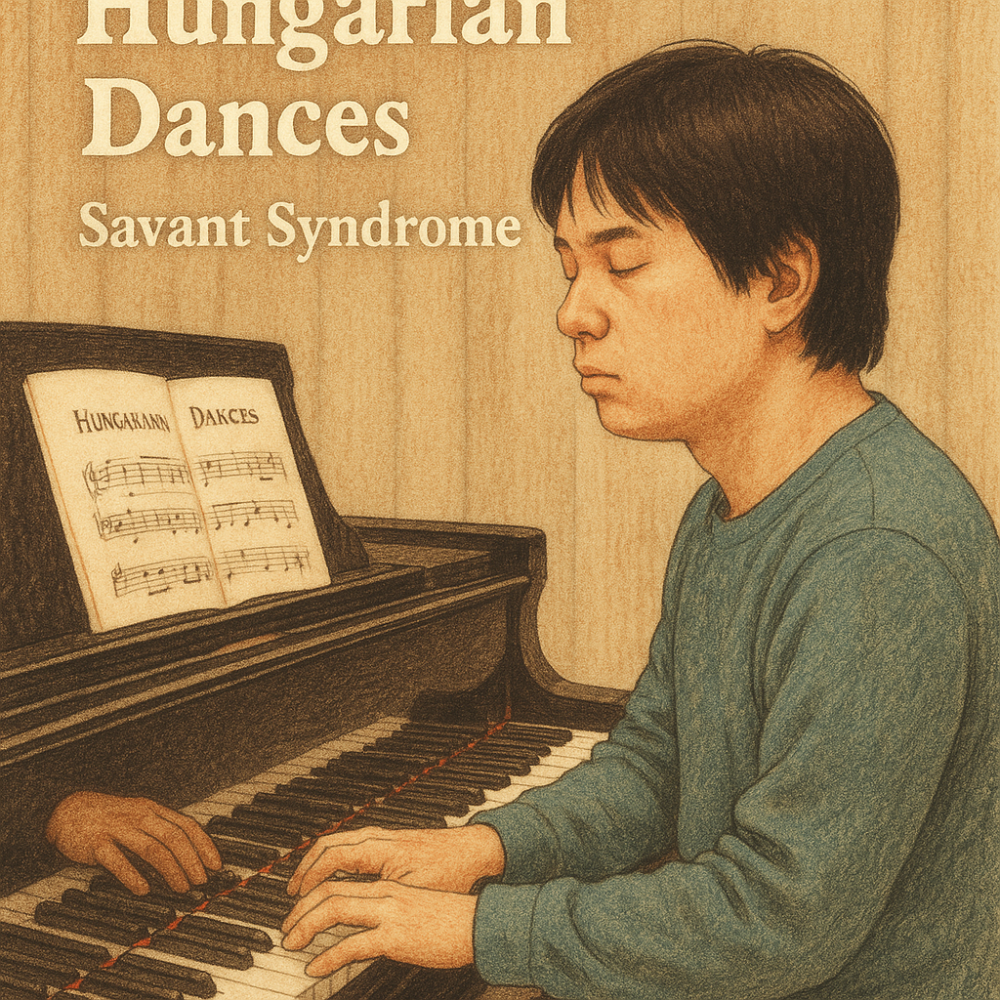

# keys to the heart 

In the movie Keys to the Heart, Brahms' Hungarian Dance No. 5serves as a powerful symbol, vividly portraying Jin-tae’s autism spectrum disorder and savant syndrome. The piece is prominently featured in a pivotal scene where Jin-tae expresses his emotions through the piano. His flawless performance of the fast-paced and intense Hungarian Dance No. 5marks a key moment of connection with his older brother, Jo-ha. Witnessing Jin-tae, whom he had underestimated, fully immersed in the music as though it were second nature, leaves Jo-ha both astonished and deeply moved. The portrayal of Jin-tae at the piano—unsteady yet profoundly focused—beautifully conveys his inner world bursting forth through music, offering a glimpse into his complex emotions and extraordinary talent.
 
Jin-tae’s condition, savant syndrome, is a rare phenomenon where individuals with autism spectrum disorder demonstrate exceptional abilities in specific areas. While Jin-tae struggles with verbal communication and relies on assistance for daily tasks, his talent for music is nothing short of extraordinary. He can flawlessly replicate a piece after hearing it just once, instinctively grasping its intricate rhythms and structures. His talent transcends technical mastery, infusing his performances with deep emotion and profound expressiveness.

In the piano scene, Hungarian Dance No. 5becomes more than just a musical piece—it acts as a bridge connecting Jin-tae’s seemingly impenetrable inner world with those around him. The frenetic tempo and sudden shifts in mood reflect the complexity of his mind, oscillating between chaos and order, vulnerability and brilliance. This synergy between music and character allows the audience to step into Jin-tae’s perspective, appreciating the beauty and richness of his unique life.
[Ultimately, the movie uses music to beautifully and movingly depict Jin-tae’s world. It celebrates the distinctive richness of his life, presenting his journey with warmth and humanity, and reminding viewers of the transformative power of music to connect, express, and transcend.](https://youtu.be/Jyqs-fyUrpk?si=uIIzP5G2rxdUWq66)

Example: The two works explore similar themes through different conditions—savant syndrome and schizophrenia. [*A Beautiful Mind*](lee_eunbi.md). Keys to the Heart uses Brahms’ Hungarian Dance No. 5 to portray the complex emotions and genius of a character with autism and savant syndrome, illustrating a world where unique sensitivity and talent coexist. On the other hand, A Beautiful Mind expresses the inner pain of schizophrenia through the song “All Love Can Be,” while also highlighting enduring love and hope. In both cases, the films present disability or mental illness not as mere deficiency, but as a unique emotional world filled with human beauty and depth.

장례식에서 연주되길 희망하는 음악 

[요한 제바스티안 바흐 (J.S. Bach) – “G선상의 아리아 No.3 (Air on the G String)"](https://youtu.be/1PkD47rNkfY?si=F2p6CaYcUuiKWbmp)
이 곡은 D장조이며, 슬픔 속에서도 평온과 희망, 영적인 안식을 느끼게 해주는 곡이다.  장례식이지만 침울한 분위기를 원치 않는 마음이 큰 만큼 이 곡은 지나치게 침울하거나 무겁지 않고, 차분하게 감싸는 듯한 멜로디로 곡이 구성된다. 
슬픔을 강요하지 않고, 오히려 남은 이들의 마음을 부드럽게 위로하는 듯한 선율이기에 이 곡을 희망한다. 
