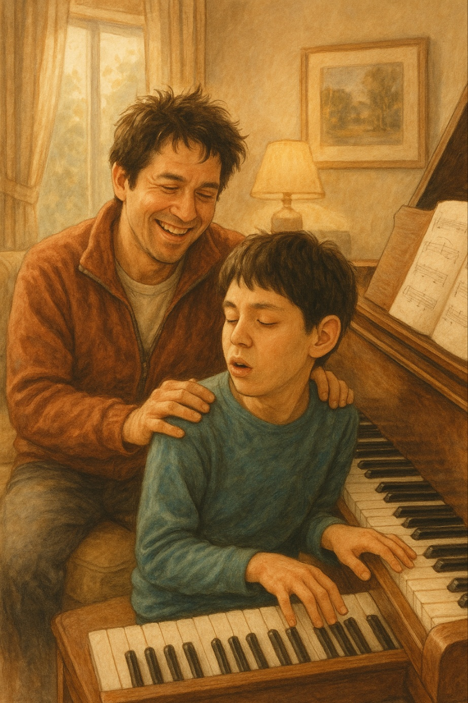

# Keys to the Heart

The main character, Jintae, who has level 2 autism, is a genius with an extraordinary talent for playing the piano. He lives in poverty with his older brother and mother,
and although he delivers flyers with his brother to earn daily wages, he sneaks away to play the piano, driven by his deep passion for music.
Recognizing Jintae’s remarkable gift and dedication, his brother Joha enters him in a piano competition, where Jintae wins a prize. 
Through his performance, Jintae transcends his difficulties and channels it into a passionate expression of music.
The film warmly portrays how others view Jintae’s playing—with kindness and admiration—and shows how his music brings harmony and warmth to a family with a disabled member. The music ['Impromptu in C sharp minor Op.66'](https://www.youtube.com/watch?v=1p9Kdu202bs) features its difficult techniques, which shows genius of the protagonist Jintae.
Also, with its tender and graceful melody, this music paints the life of the protagonist with autism in a warm and dignified light.

The same disease 'autism' is described in the movie [*Rain Man*](ahn_ire.md).
But there is a difference in respect of function of the music that performs in each movie.
The music 'Impromptu in C sharp minor Op.66' reveals Genius of the protagonist Jintae,
but the music 'Leaving Wallbrook - On the Road' shows disability of the protagonist. 

## 내 장례식에서 연주되길 희망하는 음악
내 장례식에는 ['W.Bolcom, Graceful Ghost Rag'](https://www.youtube.com/watch?v=Ico2EmLXjj4)이 연주되었으면 좋겠습니다.
이 곡은 작곡가 볼컴이 돌아가신 아버지를 그리워하면서 작곡한 곡으로 알려져있습니다.
어느날 볼컴은 자신의 어린시절에 가지고 놀던 게임기를 찾게됩니다.
그 게임기에는 레이싱게임이 들어있었습니다. 그 레이싱게임은 볼컴이 아버지와 함께 즐겼던 게임인데요, 
자신의 아버지가 달렸던 모습(유령)이 고스라니 저장되어있는 것을 보고 아버지를 그리워하며 이 곡을 작곡한 것입니다.
내가 세상을 떠나면 누군가가 나를 그리워할 것입니다. 그 누군가에게 이 곡을 선물하여 "함께여서 즐거웠다. 고마워." 라는 메시지를 전달하고 싶습니다.

