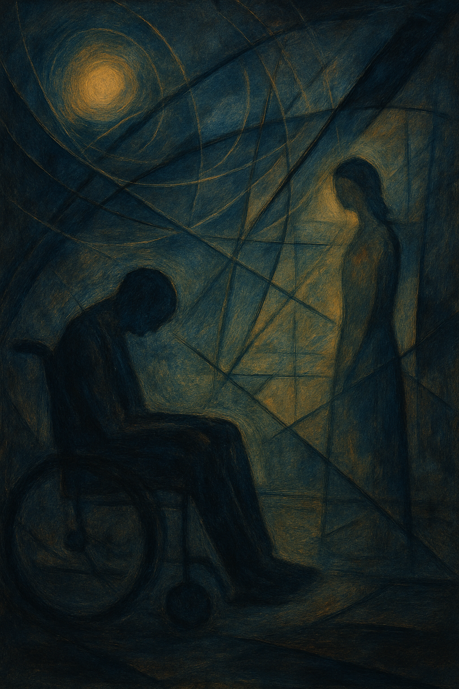

# The Theory of Everything

The Theory of Everything (2014) is a biographical film based on the life of Dr. Stephen Hawking. Richard Wagner is portrayed as the favorite composer of the film's protagonist, Stephen Hawking, and his music appears naturally throughout Stephen's life. In this film, the music is mainly used to highlight key moments or to ornament the plot. For instance, Die Walküre Act 1: Vorspiel plays during an early scene—prior to Stephen’s diagnosis with ALS—serving as a subtle 'prelude' to the story (fittingly, “Vorspiel” is the German word for “prelude”). In [this scene](https://youtu.be/XoAVDFk5PkA?si=oiC1i5FsF0pH-eUS&t=192), Stephen is working on an assignment, and he accidentally spills coffee, subtly foreshadowing the struggles he will face later on. In the case of [Götterdämmerung: Siegfried’s Death and Funeral Music](https://youtu.be/nkOiKy6sXfM?si=zW9x948mHpDp1pmT), the piece is paired with one of the pivotal scenes in the film, where Stephen, whose illness was getting worse, becomes mentally frustrated again—in terms of film technique, this scene features a shift in the diegetic levels of the music. In the latter half of the film, Stephen attends a performance of Wagner’s Götterdämmerung at a theater in Bordeaux. This scene is intercut with scenes of other characters, and the opera music Stephen is listening to also serves as the background score. While watching the opera, Stephen begins coughing up blood, and as the dramatic section of the piece plays, Stephen is carried out of the theater on a stretcher. Following an emergency tracheotomy due to respiratory failure, he survives but permanently loses his ability to speak—a moment of profound personal loss. 

Anand Tucker's 1998 film [*Hilary and Jackie*](jin_zhiyuan.md) deals with multiple sclerosis, a disease similar to ALS, that also causes a gradual loss of control over the body. Like The Theory of Everything, it is also a biopic—inspired by the life of the cellist Jacqueline du Pré. Just as Wagner’s music holds special significance for Stephen in The Theory of Everything, Elgar’s Cello Concerto in E minor carries deep meaning for Jacqueline du Pré. However, the two films diverge in their approaches to music. While The Theory of Everything uses music to support the plot, Hilary and Jackie, according to the linked document, employs it to express the protagonist’s inner conflict and solitude, adding emotional depth to the film; That said, although the use of music in the manner described above is more prominent, The Theory of Everything also contains moments in which music functions in this expressive way.

