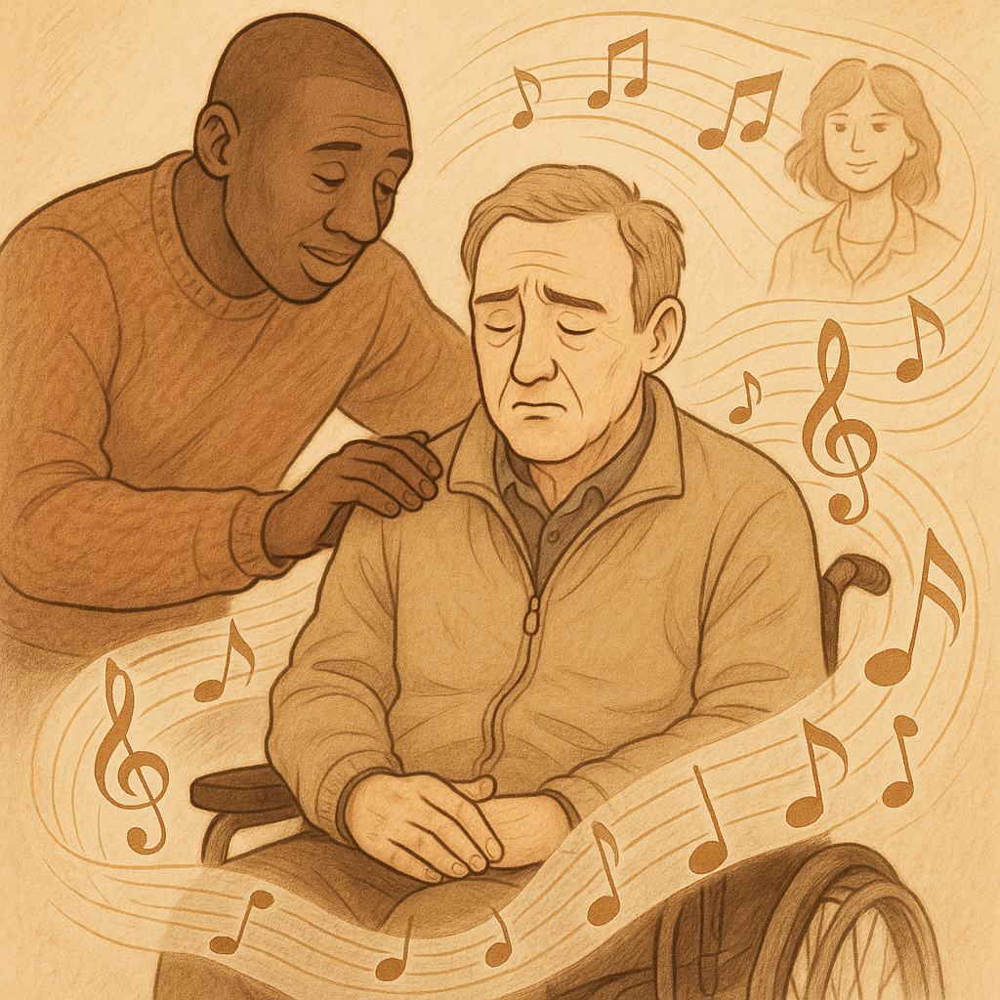

# The Intouchables

This music is played in the last scene of the film. It is the scene where the main character Philippe and his caregiver and friend, Driss, say goodbye. Philippe has lost his will to live and is in despair after Driss quit his job as a caregiver. In order to help Philippe regain his motivation, Driss arranges a meeting with a woman he has been hesitant to meet for a long time. After Driss leaves, Philippe waits for her in a restaurant, feeling nervous, but soon she appears and Philippe smiles brightly, and the film ends. [The piano music ‘Una Mattina’](https://youtu.be/ymMYzb2HBsg?si=3QtQ2TQubA58KmSm) that plays at this time seems to portray the main character Philippe’s disability in a three-dimensional way. It makes us sympathize with the bitter and empty heart of the main character who has lost his physical freedom, while also making us feel hopeful that he can live happily with his friends and in love with his lover.

In the film [My Left Foot](kim_jua.md), the classical piece ‘Theme from My Left Foot’ expresses not only the protagonist’s physical pain but also his determination to overcome it. Through this music, we can feel both the limitations caused by his disability and a sense of hope.

