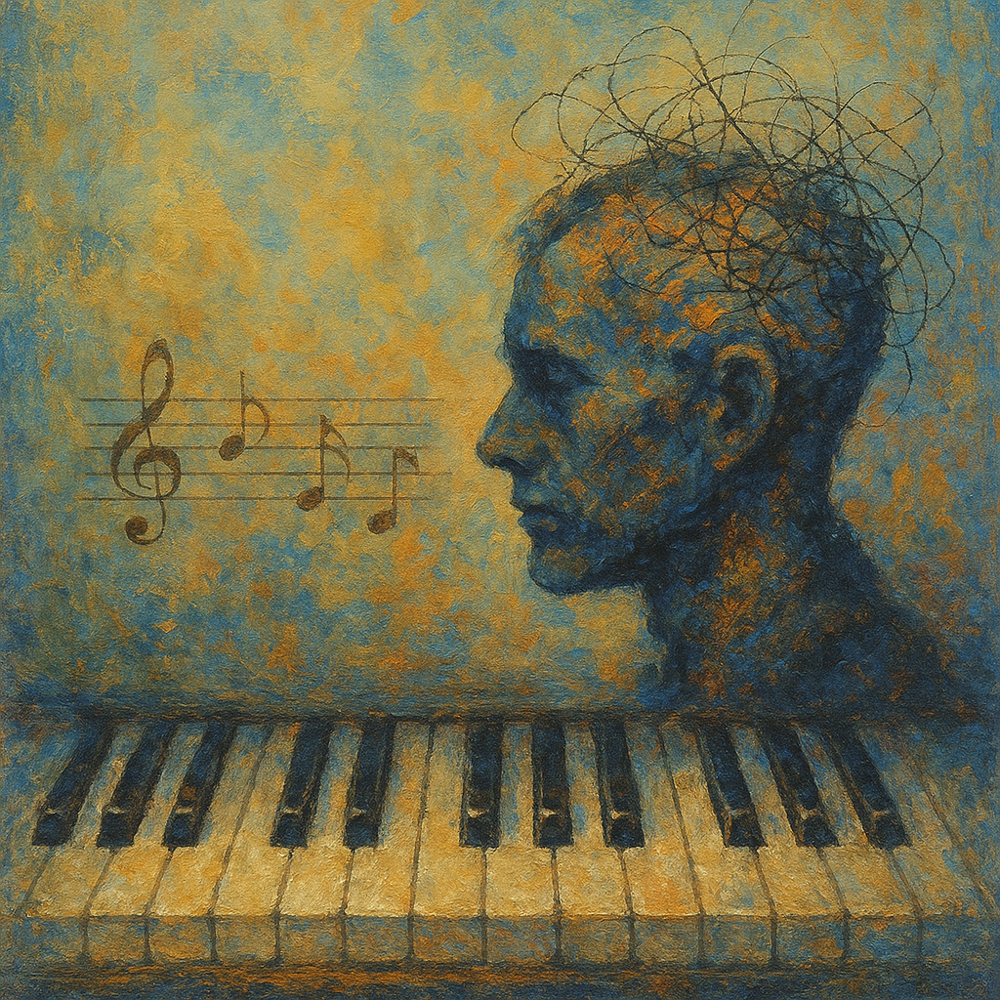

# A Beautiful Mind

This music is used in a scene expressing the genius and inner world of the protagonist, John Nash. Composed in a theme-and-variations form, the piece creates a calm yet graceful atmosphere, harmonizing perfectly with Nash's emotions as he discovers and immerses himself in mathematical patterns.By using the less commonly known first movement instead of the famous third movement, the film captures an elegant feeling, effectively reflecting the complicated situations Nash is experiencing.
[This scene](https://youtu.be/1Een0DvaBcA?si=owGz4qd4_Mh_3exo) simultaneously portrays Nash's brilliant mind and his lonely inner world resulting from his mental illness. Mozart's music deeply enhances the portrayal of these complex emotions.

In A Beautiful Mind, Mozart’s Piano Sonata No.11 in A major, K.331 (1st movement) subtly reflects John Nash’s inner world. Its theme and variations structure mirrors Nash’s search for order and patterns amid chaos, while the elegant yet quietly tense atmosphere symbolizes his isolation and internal struggles. The repeating and evolving motifs echo his obsessive thought patterns and gradual growth, and the interplay of structure and freedom within the music parallels his logical yet intuitive genius. Thus, the piece serves not merely as background music, but as a key element that conveys Nash’s psychological journey and inner complexity.

In the film A Beautiful Mind, schizophrenia is portrayed in a way that resembles, yet distinctly differs from, the autism spectrum disorder depicted in Extraordinary Attorney Woo. While both are conditions related to neurodevelopment and brain function, they are clearly separate disorders, with significant differences in causes, symptoms, age of onset, and treatment approaches. However, society often fails to distinguish between the two, perceiving them similarly. This is reflected in how both films use music to express the emotional worlds of these conditions in nearly identical ways. The simple, repetitive piano motifs of The Whale from [*Extraordinary Attorney Woo*](kim_dawon.md), and the refined yet lonely atmosphere of Mozart’s Piano Sonata No. 11 K.331, 1st movement in A Beautiful Mind, both musically convey a sense of isolation and inner depth with little distinction.

