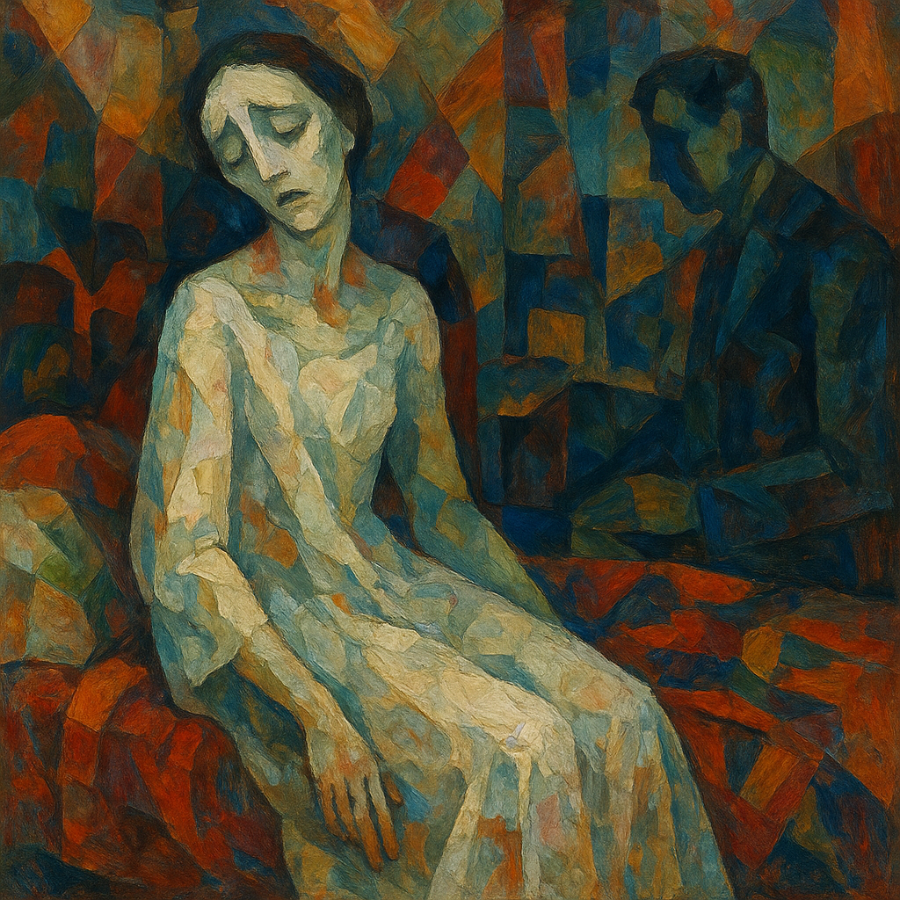

# La Traviata
La Traviata is a tragic opera by Verdi about Violetta, a Parisian courtesan who gives up everything for love. When pressured by society and Alfredo’s father, she sacrifices her happiness, and as her illness worsens, she dies alone, reflecting on her past.

"Addio del Passato" is a song that Violeta sings with a feeling of death from tuberculosis, and her weak breath and thin melody delicately express her weak body and despair. .[Verdi portrays the flame of life that gradually disappears through a slow and breakable rhythm](https://youtu.be/afhAqMeeQJk?si=QphjG2wXKIBbGVvq). The high notes conjure up passion and love of the past, but the silence and soft voice that follow emphasize her pain and resignation. The orchestra further highlights Violeta's loneliness and helplessness with minimal accompaniment. In this way, the music depicts the sadness beautifully the process of a disease destroying not only the body but also the soul

La Traviata and Wozzeck are in the same opera genre [*Wozzeck*](jang_geunyeong.md).
Both Wozzeck and Addio del passato use contrasting musical languages to depict psychological or physical decay, drawing the audience into the characters' inner worlds through distorted structures and emotionally charged soundscapes.
Both Wozzeck and Addio del passato musically depict human suffering and tragedy through the themes of mental collapse and the fading of life, respectively.

In the aria “Addio del passato”, Violetta sings a tender farewell to life and love. The fragile melody and delicate rhythm mirror her fading strength, evoking deep sorrow and the fleeting nature of happiness — like a breath dissolving into silence.

Max Richter – [“On the Nature of Daylight](https://youtu.be/InyT9Gyoz_o?si=-eoVrJ3FHloDUcx4)
이 곡은 아름다운과 고통이 공존하고 있다는 점에서 저의 장례식에서 연주되길 희망하는 곡입니다. 여러 영화와 다큐멘터리에서 상실과 회복, 죽음과 기억을 표현하는 데 사용되었고, 특히 영화 《Arrival(컨택트)》에서 삶과 죽음이 뒤섞인 사랑의 서사를 대표하는 음악으로 쓰이기도 했습니다. 장례식에서 이 음악이 흐르면, 고통마저도 아름다웠던 인생의 일부로 받아들이게 하는 정화의 순간이 될 수 있다고 생각하여 희망합니다 이 곡은 현악기만으로 구성되어 있지만, 그 어떤 가사보다도 깊고 복합적인 감정을 전달합니다. 슬픔, 후회, 사랑, 체념 같은 감정이 서서히 밀려와, 듣는 이의 마음을 조용히 무너뜨리고 말이 필요 없는 장례식의 순간에 이 음악은 말보다 많은 것을 대신해 준다고 생각합니다 

질병서사
병: 공황장애 
3년 전, 나는 공황장애 진단을 받았다. 처음 증상이 찾아왔을 땐 이유 없이 가슴이 조여오고, 숨이 막히는 듯한 공포가 몰려왔다. 아무도 없는 방 안에서 갑자기 식은땀이 흐르고, 내가 미쳐버릴 것 같다는 두려움에 사로잡혔다. 병원에서는 “심장은 멀쩡합니다. 공황장애일 가능성이 높습니다.”라는 말을 들었다.
그날 이후, 나는 매일이 불안과 싸움이었다. 엘리베이터, 지하철, 사람 많은 카페… 평범한 공간들이 하나둘 공포의 장소로 바뀌었다. 누군가 “마음먹기 나름이야”라고 말할 때면, 그 말조차 나를 숨 막히게 했다.하지만 아주 천천히, 나는 나를 이해하기 시작했다. 호흡을 가다듬고, 약물치료와 상담을 병행하면서 나는 내 감정에 이름을 붙이는 연습을 했다. “지금 불안하다. 하지만 이 감정은 지나갈 것이다.” 그렇게 말하는 법을 배웠다.
나는 병을 이긴 것이 아니다. 다만 병과 공존하는 방법을 배웠다. 더 이상 숨기지 않고, 부끄러워하지 않으며, 불안이 오더라도 이제는 어떻게 나를 다독여야 할지 안다. 나는 아팠지만, 다시 숨을 쉬기 시작했다.

유튜브 플레이리스트 (2곡)
[이이언 (Eaeon) - "Mad Tea Party"](https://youtu.be/_KTIYhzX51E)
공황 증상의 혼란스러움, 현실감 상실, 감정의 붕괴를 음악적으로 표현한 곡.

이 곡은 전자음과 왜곡된 사운드, 공허한 보컬이 어우러져 일종의 ‘심리적 무중력 상태’를 표현합니다. 현실과 꿈의 경계가 불분명한 듯한 사운드는, 정신이 붕괴되는 듯한 느낌을 매우 정교하게 구현합니다.공황장애는 말 그대로 *“예고 없이 닥쳐오는 공포”*를 특징으로 합니다. 몸이 멀쩡해도, 이유 없이 갑자기 숨이 막히고 미쳐버릴 것 같은 느낌이 몰려오죠.**"Mad Tea Party"**는 이런 혼란과 내면의 붕괴를 음악적으로 담아내고 있으며, 청자는 이 곡을 들으면서 “나만 이런 감정을 겪는 게 아니었구나”라는 공감과 해방을 느낄 수 있습니다.

[이날치 - "범 내려온다"](https://youtu.be/1uX1BM5y5Gg)
회복 이후의 활기와 자신감을 상징하는 곡. 스스로를 되찾고, 다시 일상으로 돌아오는 기운을 담았다.
퓨전 국악 밴드 이날치의 대표곡으로, 전통 판소리 가락과 현대적 리듬이 절묘하게 조화를 이루는 곡입니다. ‘범 내려온다’는 반복적인 후렴은 강한 생명력과 리듬감을 전달합니다.공황장애를 극복해나가는 과정은 단순히 병이 사라지는 것이 아니라, 삶의 리듬을 되찾고 나를 회복해가는 과정입니다.
**"범 내려온다"**는 단순히 흥겨운 곡이 아니라, 내 안의 힘이 다시 깨어나는 순간을 표현합니다. 처음엔 낯설지만 점점 리듬에 몸이 반응하게 되고, 마침내 "살아 있다"는 감각을 되찾게 하죠.

