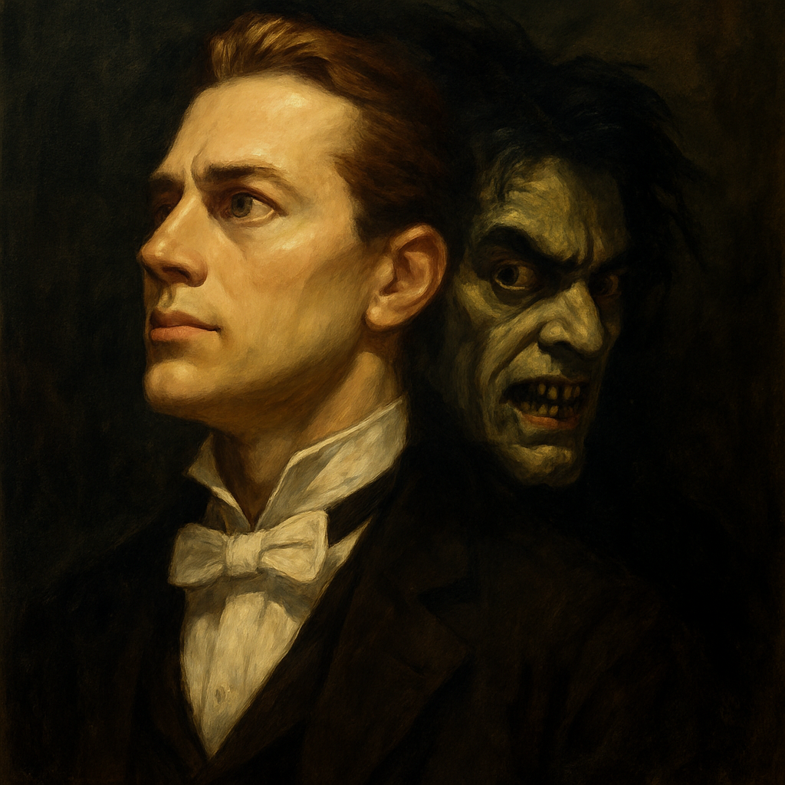

# strange case of Dr.Jekyll and Mr.Hyde

The plot of Jekyll and Hyde is as follows. Set in 1880s London, Jekyll and Hyde tells the story of Dr. Henry Jekyll, a brilliant physician and scientist who develops a drug to separate the good and evil sides of human nature in an effort to cure his mentally ill father. Choosing to experiment on himself, he transforms into a violent and uncontrollable alter ego named Edward Hyde. At first, Jekyll believes he can control Hyde, but over time, the dark personality takes over, committing horrific crimes. Eventually, Jekyll is forced to confront the consequences of his actions and make a tragic choice to end the chaos he unleashed.

In the musical, Dr. Jekyll deliberately induces a split in his personality by creating a scientific formula to separate good and evil. The result is Edward Hyde, who emerges as a completely distinct being—different in appearance, speech, behavior, and moral compass.

This depiction mirrors key characteristics of Dissociative Identity Disorder (DID), including:
Memory Gaps: Jekyll often cannot recall Hyde’s actions, or only remembers them partially.
Switching Between Personalities: The transformation between Jekyll and Hyde is initially triggered by the drug but later occurs uncontrollably.
Split Self-Perception: Jekyll views Hyde as a separate entity, often with fear and disgust.

However, it’s important to note that this portrayal is symbolic and dramatized for theatrical effect. In reality, DID is not caused by drugs, and alternate identities are not always violent or so clearly distinct in behavior.

[“This is the Moment”](https://m.youtube.com/watch?v=cJ5iKRpE41E&pp=ygUn7KeA7YKsIOyVpCDtlZjsnbTrk5wgdGhpcyBpcyB0aGUgbW9tZW50) is performed when Jekyll resolves to test his experimental drug on himself. On the surface, it is a triumphant declaration of scientific ambition and self-sacrifice. But beneath the surface, it marks the awakening of Jekyll’s repressed desires and darker self.
The lyrics and melody convey resolution and inspiration, but they also hint at Jekyll’s arrogance and risky pursuit. As the song ends, it acts as a ritual of invocation, welcoming Hyde into the world. Thus, the song can be seen not just as a declaration of intent, but as the catalyst for unleashing Hyde, transforming a moment of hope into the beginning of a nightmare.

In this way, “This is the Moment” does not merely represent a turning point for Jekyll—it is the symbolic birth of Hyde.

Example: A similar disease(mental disorder) is described in Belle's 2021 film [*The Dragon and the Freckled Princess*](huh_yejin.md). Both social and multi-personality disorders have in common that they have difficulty maintaining daily interpersonal relationships.

장례식에 틀고 싶은 음악: [*River flows in you*](https://m.youtube.com/watch?v=7maJOI3QMu0&pp=ygURcml2ZXIgZmxvdyBpbiB5b3U%3D)

River flows in you는 한국 작곡가이자 피아니스트 이루마가 2001년에 발표한 피아노 솔로곡으로, 그의 대표작이자 세계적으로 널리 알려진 뉴에이지 피아노 곡이다. 장례식에 이 곡을 틀고싶은 이유는 어릴 때 가장 좋아했던 클래식 음악이기도 하고, 가사 없는 선율이기 때문에 조용한 추모 분위기에 어울린다고 생각하기 때문이다. 나의 장례식이 너무 어두운 분위기지 않았으면 하는 바람이 있어서 따뜻한 느낌을 주는 이 곡을 틀어놓고 싶다.
