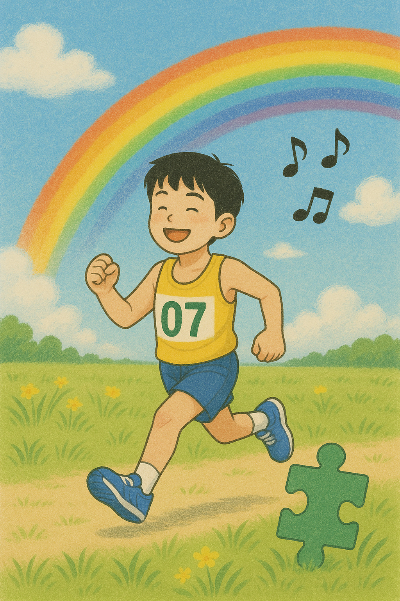

# Maraton

“Run, Cho-won” is used in the film's climactic and final marathon scene, depicting a pivotal moment when the protagonist, Cho-won, who is on the autism spectrum, overcomes his physical and emotional limitations. Composer Kim Jun-sung uses a delicate blend of piano and strings to portray Won's inner thoughts. In the opening, a cautious, hesitant melody expresses Won's anxiety and focus, and as the scene unfolds and Won finds his rhythm, the music expands into warm, [lush string harmonies that convey a sense of emotional release.](https://youtu.be/6nM9hL95LzA?si=K-sWANjdfgn4h9jX)
This musical development is closely synchronized with the flow of the visuals. As Won runs the final stretch and is cheered on by his mother, the music gradually builds to a crescendo as he completes the marathon, heightening the emotional moment. In this scene, the music represents not just success, but the possibility of doing the impossible. The music doesn't package Meadow as “special” or make him an object of pity, but shows his emotions in a genuine and sensitive way.
The world of the meadow is not portrayed as something disconnected from the outside world, but as a world of deeply human emotions that anyone can relate to, and we can feel that autism is not a disability, but a different life, a life that can be conveyed without words. 

The ballad used in the drama [“It's Okay, It's Love”](do_gwanwoo.md) delicately depicts the emotional journey of Jang Jae-yeol, who suffers from schizophrenia. The lyrical melody and emotionally charged vocals express his confusion of reality and illusion, his loneliness, and his complex feelings in love. The music becomes a musical vehicle to convey Jang's vulnerability and hope for healing.

This way of expressing psychological pain and emotion is also deeply connected to the film I analyzed, Malathon. Although Malathon has a different narrative, as it deals with autism, it has similarities in that it uses music to show the inner world of the protagonist. In particular, the interlude “Run to the Meadow” conveys to the audience what Won-woon is feeling without words, demonstrating that music functions as a narrative tool beyond just a background.

---

# 장례식에서 연주되길 희망하는 음악
Le Festin - Disney Pixar's "Ratatouille" OST 

[‘Le Festin’](https://youtu.be/E2Tj_CQDrk4?si=yR8IYDhyQWpJm0b6)은 
조용하지만 단단한 느낌이 있어서, 내 삶을 잘 정리해주는 곡처럼 느껴진다.
혼자서도 충분히 괜찮았다는 걸 말해주는 듯해서, 마지막 인사로 어울린다고 생각했다.
화려하진 않았지만 나름대로 의미 있었던 시간들이 떠오를 것 같아서,
이 노래가 흐를 때 나를 아는 사람들이 조금은 따뜻하게 웃어줬으면 좋겠다는 마음에서
이 노래를 선정하게 되었다.

