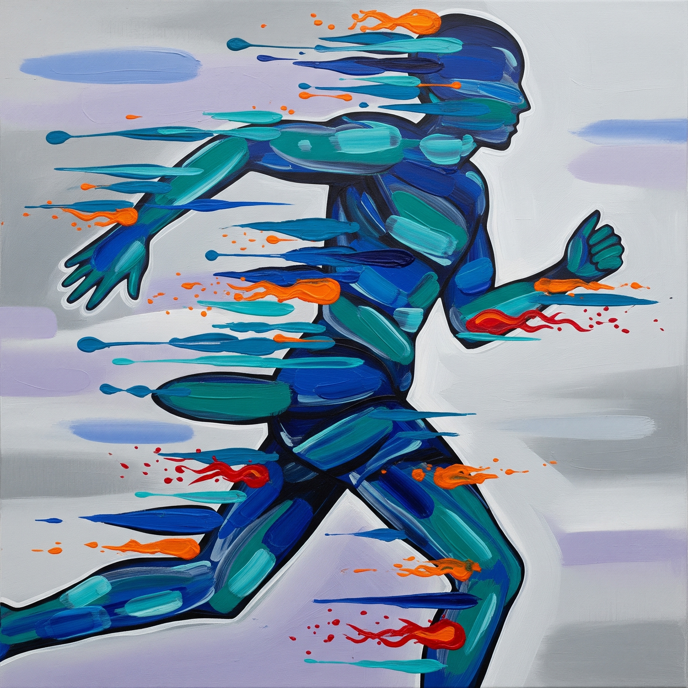

# Malaton(말아톤)

Cho-won is an autistic disabled person who looks normal on the surface, but his mental age remains at five. His mother, Kyung-sook, discovers that Cho has a special ability to run and trains her son devotedly to completing the full course of the marathon. Meanwhile, Jung-wook, a former marathoner who came to community service by driving under the influence, takes Cho-won's coach. Finally, Cho-won completes the marathon, through which Cho and his family understand each other and grow up.

[This song](https://www.youtube.com/watch?v=6nM9hL95LzA) reflects the regular and repetitive lifestyle of the main character, and describes the disconnection from the world that autism creates. The fast and cheerful rhythm represents the constant effort and independence of the main character, and at the same time emphasizes that his world is a detailed and solitary space. The music serves to emphasize that his emotions are not well communicated with the outside world, but that they are constantly moving inside.

Similarly, schizophrenia, classified as ICD 6A, is described in the 2014 drama [*It's Okay, That's Love*](do_gwanwoo.md) by Noh Heekyung, sung by singer Davichi, in a song with the same name as the drama.

