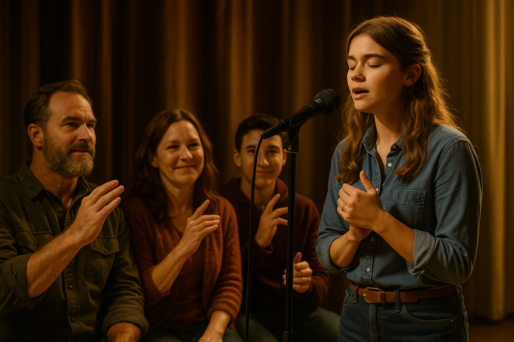

# CODA 

In the film CODA, "Both Sides Now" plays a crucial role in portraying disability not as a mere deficiency, but as a bridge connecting different worlds. [*The scene where Ruby sings this song in sign language during her audition symbolically expresses the boundaries and communication challenges between her deaf parents and herself as a hearing child.*](https://www.youtube.com/watch?v=qlTEAXcKssg) Like the lyrics of the song, Ruby-who has experienced both sides of life: sound and silence, understanding and misunderstanding, loss and growth-conveys her heart to both her family and the world through her voice and her hands. Reflecting the film’s message that music can be appreciated even without hearing, "Both Sides Now" presents disability not as something to overcome, but as another way of perceiving the world through diverse senses and languages.

By performing the song in both voice and sign language, Ruby transforms "Both Sides Now" into a truly inclusive experience, allowing her deaf parents to feel the music visually and emotionally. This scene highlights that music is not limited to sound alone, but can be shared through movement, expression, and touch. The song’s original meaning—reflecting on life’s dualities—mirrors Ruby’s own journey between the hearing and deaf worlds, and her performance becomes a powerful bridge that connects and unites both communities.

The same disease is described in Naoko Yamada's 2016 Animated movies [*A Silent of Voice*](lim_seokhyeon.md). The part about experiencing sound from the perspective of a person with hearing impairment was different from mine. Also, the mention of emotional isolation was different from mine, but the aspect regarding hearing impairment itself was consistent with mine.

