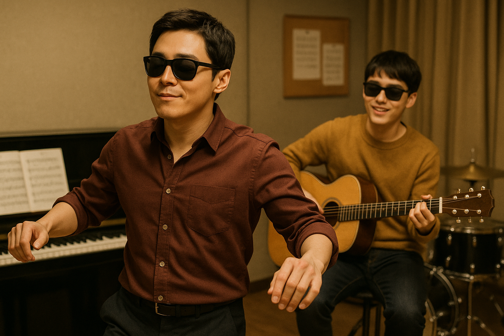

# My Annoying brother

Director Kwon Soo-kyung’s film My Annoying Brother (2016) tells the story of Ko Doo-young (played by Do Kyung-soo), a promising national judo athlete who loses his sight in an accident, and his estranged older brother Ko Doo-sik (played by Cho Jung-seok), who is released from prison to serve as Doo-young’s legal guardian. The film traces the emotional journey of the two brothers as they move from deep-seated conflict and mistrust to reconciliation and a renewed sense of familial love.

[In one of the film's most memorable scenes](https://youtu.be/qX9EOm06Ybc?si=Jq-kcLB0wy9dkQ0Q), when the brothers finally begin to bridge the emotional distance that has separated them for years. In a warm and symbolic moment, Doo-sik and Doo-young dance samba together in their small living room. The scene is tender yet vibrant—Doo-sik leads with exaggerated, playful movements, while Doo-young gradually follows his rhythm, laughing and stepping in sync despite his blindness. This shared moment of joy reflects not only their growing trust but also their emotional healing. As the two twirl and sway, their physical closeness mirrors their emotional closeness, suggesting a return to brotherly intimacy that had long been absent.

The background score “Oh! Brother” plays a crucial role in shaping the atmosphere of the scene. Although the piece is instrumental and contains no lyrics, its upbeat rhythm and affectionate tone perfectly capture the shift in mood—from estrangement to acceptance, from bitterness to hope. The lighthearted samba melody brings a sense of spontaneity and warmth, reinforcing the emotional thaw between the brothers. The music becomes a language of its own, communicating feelings that words cannot fully express and emphasizing the transformative power of love and forgiveness.

This emotional arc closely parallels the traditional Korean pansori [*Simcheongga*](ahn_ryeogyeong.md), compiled by Song Manjae in the early 19th century. In Simcheongga, the blind father Sim Bong-sa is eventually reunited with his daughter Sim Cheong, whose sacrificial devotion restores both his sight and their familial bond. Much like Sim Cheong’s return brings about healing and joy, the samba scene in My Annoying Brother symbolizes a modern-day reunion—a moment where disability, sacrifice, and unconditional love intersect to offer redemption. By drawing on this cultural parallel, the film reinterprets timeless Korean values such as endurance, filial piety, and emotional resilience through a contemporary lens.

The inclusion of the samba dance—joyful, rhythmic, and intimate—becomes a metaphor for reconciliation. It is not just a moment of levity but a turning point that encapsulates the film’s core message: that family, despite hardship and history, can be a source of healing and strength. The scene powerfully illustrates how even in silence or with laughter, love finds a way to speak. In doing so, My Annoying Brother connects the modern cinematic experience with Korea’s rich storytelling tradition, bridging past and present in a poignant and meaningful way.

자신의 장례식에서 연주되길 희망하는 음악: [지난날 - 유재하](https://youtu.be/0_ZJfwM2bMs?si=KPES2C54UTZL-aKv)

https://youtu.be/0_ZJfwM2bMs?si=KPES2C54UTZL-aKv

유재하의 「지난날」을 장례식에서 틀고 싶은 음악으로 선택한 이유는, 이 곡이 지닌 서정성과 진정성이 이별의 순간에 전하고 싶은 마음을 가장 잘 담아낼 수 있다고 느꼈기 때문입니다.
「지난날」은 제목 그대로, 함께했던 소중한 시간들을 돌아보게 만드는 곡입니다. 담담하면서도 애틋한 노랫말, 그리고 유재하 특유의 섬세하고 따뜻한 목소리는 단순히 슬픔을 표현하는 것을 넘어, 지나간 시간에 대한 그리움과 감사, 그리고 미처 다 하지 못한 말들에 대한 아련함을 전해줍니다.

장례식이라는 마지막 인사의 자리에서 우리는 흔히 말로 표현하기 어려운 감정들을 마주하게 됩니다. 슬픔, 허망함, 그리움, 감사, 사랑… 이 모든 감정이 복잡하게 얽혀 있는 순간에 「지난날」은 소란스럽지 않으면서도 조용히 마음을 울리는 방식으로 그 감정들을 전합니다. 이 곡을 듣고 있으면 마치 고인과 나누었던 시간들이 하나하나 떠오르고, 그 시간이 얼마나 소중했는지를 다시금 느끼게 됩니다.
특히 “다시는 오지 않을 지난날들을 나는 그리워하네”라는 가사처럼, 이제는 되돌릴 수 없는 시간에 대한 회한과 그리움을 담담히 노래하는 이 곡은, 고인의 삶을 추억하고 애도하는 데에 더없이 어울리는 음악입니다.

또한 「지난날」은 유재하라는 뮤지션의 짧지만 깊은 삶이 오롯이 담긴 곡이기도 합니다. 그의 음악이 지닌 순수함과 인간미는 고인을 추모하는 자리에 따뜻한 울림을 더해줄 것이고, 남겨진 사람들의 마음에도 조용한 위로가 되어줄 것이라 믿습니다.
그래서 저는 이 곡이 고인을 기억하고 보내는 이 자리에 가장 진심 어린 음악이 될 수 있다고 생각하여, 「지난날」을 장례식에서 함께 나누고 싶다는 마음으로 선택하게 되었습니다.

질환서사

A는 어릴 적부터 사물의 미세한 그림자와 색의 변화에 유난히 민감한 아이였다. 중학생 때 중고 필름카메라를 선물 받은 이후, 그는 렌즈를 통해 세상을 바라보며 살아왔다. 고등학교를 졸업한 뒤 사진학과에 진학했고, 23세에는 첫 개인전을 열 만큼 주목받는 신예 작가로 떠올랐다.
그러던 어느 날, A는 여느 때처럼 새벽녘 안개 낀 산을 촬영하기 위해 무리하게 출사를 나갔다. 하지만 돌아오는 길, 도로에 놓인 공사장 구조물을 피하지 못하고 오토바이 사고를 당했다. 외상은 경미했지만, 충격으로 인해 시신경에 손상이 가는 드문 자가면역성 질환이 발병하게 되었다. 병명은 레베르 시신경병증(Leber's Hereditary Optic Neuropathy, LHON) — 유전적 소인이 있던 그는 사고의 충격을 계기로 급격한 시력 손실을 겪게 된 것이다.
처음에는 중심 시야가 흐려지고, 색이 왜곡되어 보였다. 병원을 전전하며 약물 치료와 재활을 시도했지만, 결국 몇 달 만에 양쪽 눈 모두 중심 시력을 상실하게 되었다. 빛의 방향만 느낄 수 있을 뿐, 더 이상 A는 피사체의 눈빛도, 노을의 붉은 색도 카메라 뷰파인더 속 그 미세한 초점도 느낄 수 없게 되었다.
이후 A는 사진기를 내려놓고 한동안 세상과 단절된 삶을 살았다. 하지만 어느 날, 자신이 생전에 찍었던 수천 장의 사진을 점자 음성 해설 도서로 만들고 싶다는 생각을 하게 된다. 그는 시각을 대신해 소리, 냄새, 감촉 등 다른 감각을 통해 세상을 재구성하는 훈련을 시작했고, 보조 장비와 음성 소프트웨어를 활용해 다시 창작 활동을 시도하게 된다.
지금 그는 ‘감각의 사진 작가’로 불리며, 시각 장애인이 아닌 누구보다도 섬세한 감각으로 삶을 기록하고 있다. "빛이 사라진 후, 나는 어둠 속에서 더 많은 것을 보게 되었다"는 그의 말은 수많은 사람들의 마음에 깊은 울림을 남기고 있다.

플레이리스트

[루시드폴 – ‘보이나요’](https://youtu.be/OKqbFP7dDkI?si=AGy3GICTDPuC6HZ9)
이 곡은 잃어버린 것에 대한 담담하면서도 깊은 애도를 담고 있습니다. 특히 자연, 존재, 감각의 세계를 향한 시적 언어가 가득하며, 시각을 잃은 유하진이 '보는 것'에 대해 다시 사유하게 되는 감정과 잘 맞아떨어집니다.
루시드폴 특유의 절제된 보컬과 어쿠스틱한 사운드는 하진의 조용한 슬픔과 서서히 피어나는 감각의 재구성을 아름답게 그려냅니다.

[Lauv – ‘Modern Loneliness’](https://youtu.be/bDidwMxir4o?si=TKE4gpHwEEQZPVZz)
세상과의 단절, 내면적 고립, 그리고 다시 세상과 연결되고자 하는 감정이 현대적인 감성으로 잘 표현되어 있어, 하진이 시각 장애 이후 느꼈던 정서와 회복 과정에 어울립니다.
