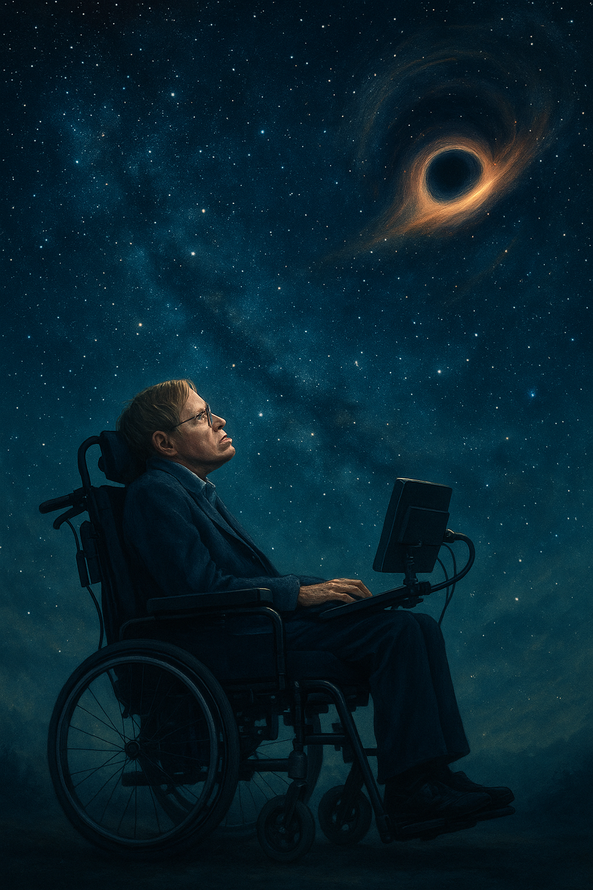

# The theory of everything
This film tells the story of Dr. Stephen Hawking, a brilliant physicist diagnosed with ALS, who gradually loses his motor functions while continuing his groundbreaking work and personal journey. Through this, the film portrays not only the physical challenges of ALS but also the emotional resilience required to face them.

[The music](https://youtu.be/81LUdSyCEt8?si=pCfDgdp7G1QlNy52), composed by Jóhann Jóhannsson, uses a warm yet intricate orchestral arrangement characterized by delicate string layers, subtle crescendos, and shifting tempos. These musical elements mirror the protagonist's internal conflict—his despair, determination, and eventual acceptance of his condition. The orchestration grows heavier and more complex during moments of struggle, and lighter and more open during moments of insight or hope.

In particular, the track "Collapsing Inwards" clearly expresses the emotional weight of confronting the reality of a degenerative disease. Rather than simply accompanying the visuals, the music intensifies the sense of isolation and vulnerability, helping the audience empathize deeply with Stephen’s experience.

This work is related to [*My Left Foot*](jiang_jingrong.md), which also deals with a biographical story of a person with a severe physical disability. Although ALS and cerebral palsy are different in cause and progression—ALS being a progressive adult-onset disease and cerebral palsy being a non-progressive congenital condition—both films portray protagonists with severe motor impairments who achieve remarkable accomplishments through determination and support. In both cases, music plays a vital role in expressing the characters' emotional states and their journeys of overcoming physical limitations.

