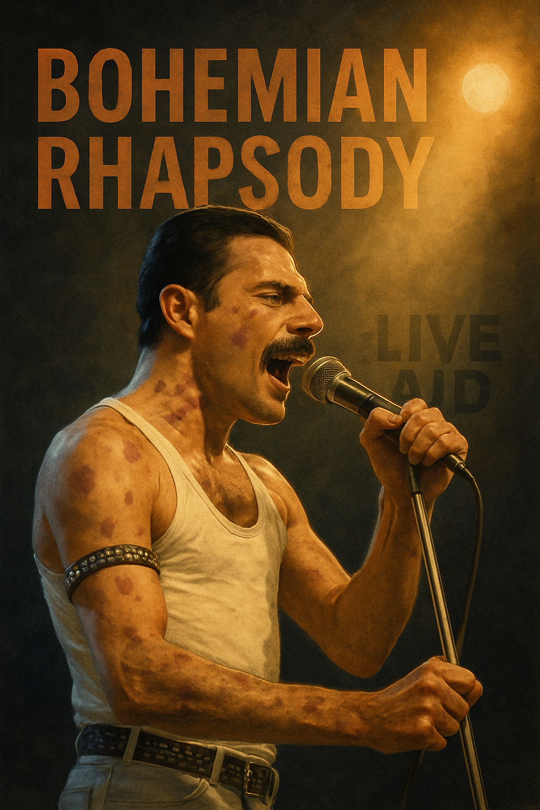

# Bohemian Rhapsody

In the movie Bohemian Rhapsody, Freddie's health is slowly hinted at throughout the film. He coughs and groans, and his face shows fatigue. However, the name AIDS is not directly mentioned in the beginning of the film. In the latter half of the film, Freddie visits a hospital and hears "bad news" from a doctor. This scene is directed quietly and heavily, and although the disease is not specifically mentioned, the reason can be guessed through the sexual orientation of the main character who appears in the middle. In reality, there are different opinions about the date of diagnosis based on the Live Aid concert. And it is said that Freddie also knew that his condition was worsening(both in movie and reality) and was quite shocked by the diagnosis.

But, Freddie calmly tells the members of Queen that he has a fatal disease and asks them, "Don't pity me." He also affirms his life by saying, "We have to make music together." In both the play and in reality, Freddie chose to create instead of feeling self-pity due to this disease, and instead of revealing his disease, he explosively created musics and accepted death in his own way. In particular, he revealed his diagnosis to the public the day before his death, showing an attitude of "communicating with actions, not words, with art." 

[The climax of the film, the 1985 Live Aid concert(In movie)](https://www.youtube.com/watch?v=QXbqiAZgeCE) [(And this link is real concert that Freddie really did)](https://www.youtube.com/watch?v=vbvyNnw8Qjg) actually happened before Freddie actually contracted AIDS, but the film dramatized it to be right after he was diagnosed with AIDS for dramatic effect, showing his determined appearance. So the film creates an emotional atmosphere that makes the Live Aid stage feel like the last dying flame in his life, not just a simple performance. Also, the song "Bohemian Rhapsody" was a song that was dismissed by a record company executive in the film as a "weird, six-minute song" saying, "Who would listen to this on the radio?", so the climax of the song synergizes with Freddie Mercury's illness to create an even more dramatic effect.

In short, it shows the conflict over the song Bohemian Rhapsody, aka the trash song, and the dark personal conflict over Freddie Mercury's illness, and the climax is dramatic when the main character sings the legendary song 'Bohemian Rhapsody' at the last performance.

# The Music I Wish to Be Played at My Funeral

I chose LeeChanhyeok's ['장례희망(Funeral hope)'](https://www.youtube.com/watch?v=iIn_1_XDuBM) because what this song expresses is very simillar to things I often imagine.
Some of lyrics like "Congraturations, cheers, and applause at my funeral that I often imagined.", "I wanted it to be party because I'm in haeven now." and lyrics saying that I hope you leave me as a good memory or that haeven really exists are things that I imagined. So, I think this song expresses my imagination so well that I hope it will be played at my funeral as I speak to the people around me and the people I care about.
