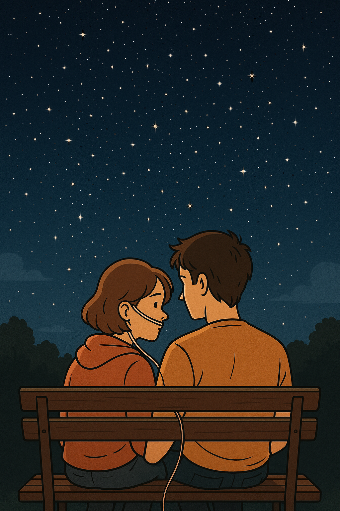

# The Fault in Our Stars

"All of the Stars” captures the loss, love, and fear of death felt by the two main characters through its gentle and lyrical melody. Instead of easing the harsh reality of cancer, the lyrics blend hope and farewell, conveying a heartfelt tone that quietly accepts sorrow and seeks to live through it together. [Lines like “I can hear your heart on the radio beat / They’re playing ‘Chasing Cars’ and I thought it of us” express a deep emotional longing, grounding their love in ordinary yet powerful moments of connection.](https://youtu.be/nkqVm5aiC28?si=hbS6j6MBKoU9OqKv)

The film portrays cancer not only as a physical illness but also as an emotional and relational burden that reshapes how individuals connect with each other and find meaning in limited time. By focusing on the daily lives and inner emotions of young patients, the story sheds light on the human side of illness, challenging social discomfort around discussing terminal disease and emphasizing the importance of empathy, dignity, and shared experience in the face of mortality.

Example: The similar disease is described in Tsukikawa Sho's 2017 Film [*Let Me Eat Your Pancreas*](choi_yunji.md), where the story revolves around a high school girl secretly living with a terminal pancreatic disease. Like The Fault in Our Stars, the film explores how impending death deepens emotional connections and highlights the beauty in everyday interactions, emphasizing that even brief relationships can leave lasting impressions.

If I could choose the music to be played at my own funeral, I would choose [traditional Buddhist music](https://youtu.be/SQ4D5x_yEE0?si=maGy30lv7scAlNJq). The soft chanting and calming rhythms bring me a deep sense of peace and help me reflect quietly. I find comfort in its simplicity and spiritual depth, which creates a serene atmosphere. I hope this kind of music would also bring peace to those attending, offering them gentle comfort rather than sorrow. It would be a way of sharing my values of calmness, mindfulness, and acceptance even in the final moment.
