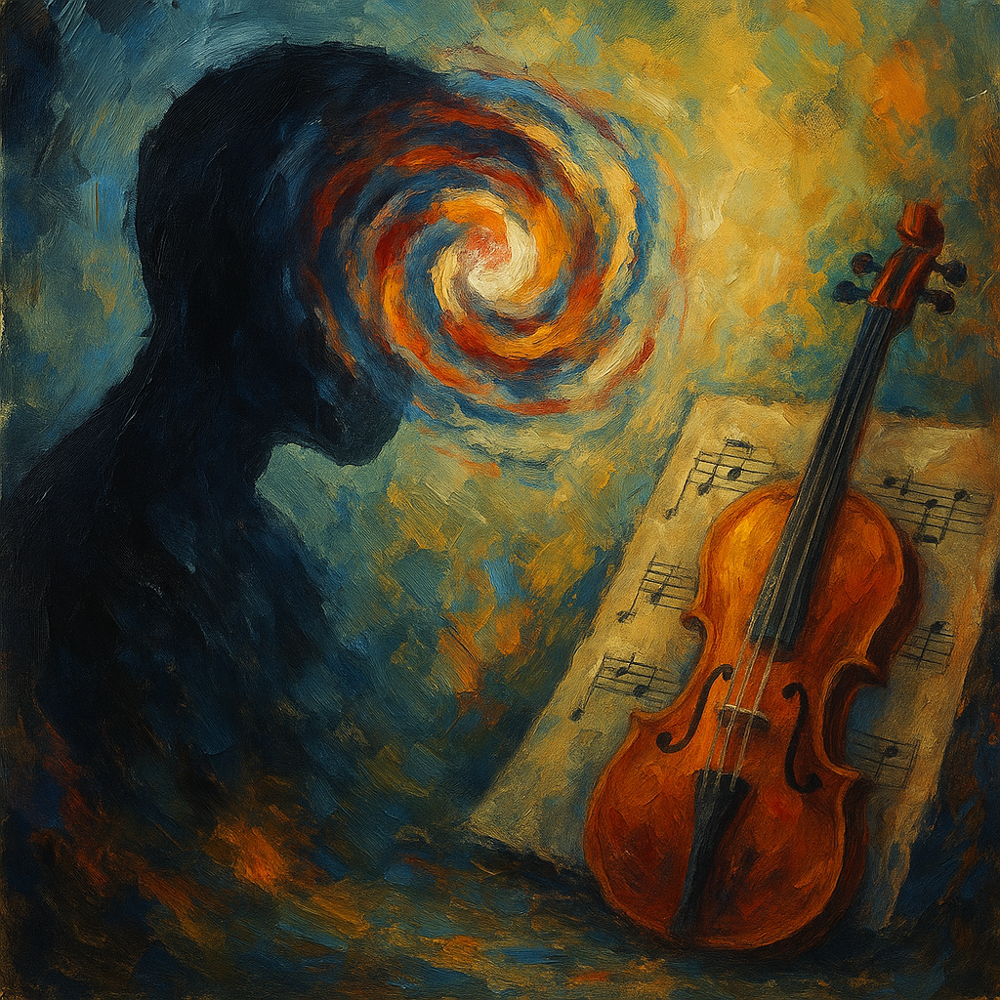

# A Beautiful Mind
["All Love Can Be"](https://youtu.be/Kajazfzb0Ow?feature=shared) from themovie Beautiful Mind, is a combination of gentle orchestra and calm vocals. This music helps us to understand not only the background of the movie, but also the emotions and situations experienced by the protagonist, John Nash.

Nash, the protagonist of the film, is a genius mathematician but suffers from schizophrenia, which affects a person's ability to think, feel, and judge reality.
Due to the influence of schizophrenia, hallucinations and delusions frequently appeared to him, which caused many difficulties not only in his research activities but also in human relationships.

But instead of just focusing on the pain, the song reflects how Nash tries to keep going with his life. As it goes on, more instruments come in, and it feels like that mirrors the way he slowly starts to face his confusion and find some order in it. \
It’s also played after the scene where Nash receives the Nobel Prize in Economics, and it helps the feeling of the film stay with you a little longer afterward.

After learning about schizophrenia, the feeling of this music becomes deeper. The subtle harmony changes or layered sounds of the song express the tension between Nash's inner world andreality, and in the end, this music conveys themessage that love can be an important force to hold a person, no matter how confused his mind is.

Example : The same diesaese described in Noh Hee-kyung's 2014 drama [*it's Okay, That's love*](yoon_sooim.md)

# 나의 장례식에서 흘러나왔으면 하는 음악
[Erik Satie – Gymnopédie No.1](https://youtu.be/S-Xm7s9eGxU)

There’s something about this song that makes everything feel still. It’s not sad or anything. It just feels calm, like taking a deep breath. I think it would be nice to play this at my funeral. Not to make people cry, but to help them feel a little more at peace. \
I hope the music makes the room feel soft and quiet. Nothing fancy. Just a peaceful moment that gives people a small break from everything. If it can do that, that’s more than enough for me.

# 질병서사 플레이리스트
질병에 대한 서사로 저는 제 이야기를 해보려합니다. 독감유행시기에 독감 예방주사를 맞지않으면 늘 독감에 걸리곤 했습니다. 갑자기 오한이 오고, 체온계가 39도를 가리키며 근육통으로 인해 온몸이 쑤시면 '아, 독감에 걸렸구나' 하며 깨닫곤 했습니다. 약을 먹기 싫어해서 그렇게 아프면서도 일부러 약을 거르곤 했던 어린시절의 기억, 그리고 독감에 걸린 내내 정신이 몽롱했고 머리는 깨질듯이 아팠던 그때의 경험을 담아 [해당 플레이리스트](https://youtube.com/playlist?list=PLqyok87vsw8oUxPJwFp8SWFPUS4li0qhL&feature=shared)를 만들었습니다. 베토벤의 교향곡 5번 1악장은 독감을 직감했을때의 감정, 드뷔시의 목신의 오후 전주곡은 정신이 흐릿해지는 경험을 드러내고자 하였고, 쇼스타코비치의 교향곡 11번 1악장은 제가 느꼈던 고통을 표현하고자 넣었습니다.

