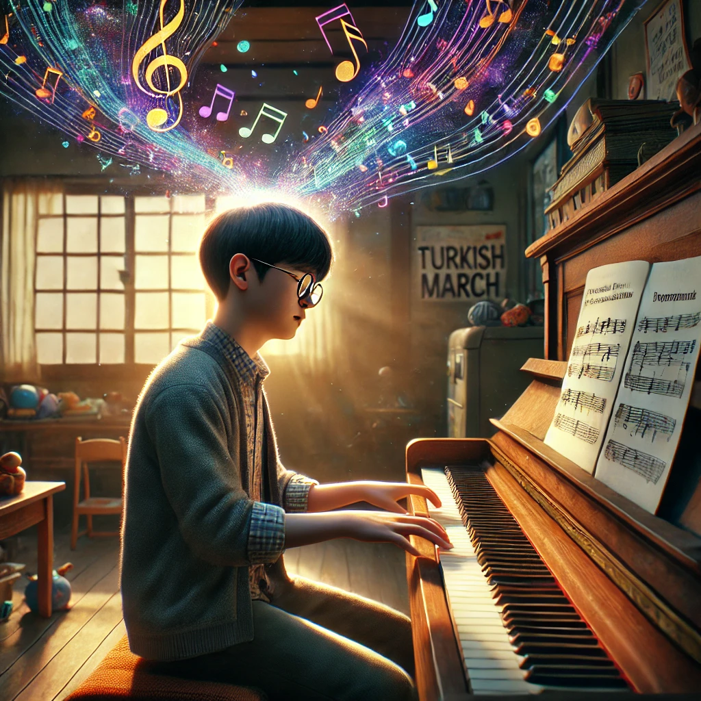

# keys_to_the_heart

The Turkish march's characteristic lively and cheerful feeling represents Jin-tae's pure and free perspective on the world and Through the [*Turkish march*](https://youtu.be/HMjQygwPI1c?si=bVuEghC8X-LSoMZr), we are trying to show the disease (Savant syndrome) of Jin-tae (main character) not just a disability, but a different world

Both films focus on characters with special abilities with Sarvant syndrome or [*autism spectrum disorder*](ahn_ire.md), attempting to break social prejudice against disability and take a humane approach.

# 내 장례식에서 연주되었으면 좋겠는 음악
[*Debussy-Rêverie*](https://youtu.be/QRjllL-MP0U?si=1cl64QulNgNcJmKn)
드뷔시의 음악은 대체적으로 섬세하고 몽환적인데 그 중 rêverie는 프랑스어로 해석했을 때 몽상,즐겁거나 슬픈 무언가를 스스로 떠올리고 생각에 빠지는 상태를 말한다 이를 바탕으로 나의 장례식에서 드뷔시만의 흥분된 마음을 가라앉게 해주는 선율과 rêverie의 뜻대로 누군가가 나와의 기억 중, 즐겁고 슬펐던 기억들을 떠올리며 인사해주었으면 좋겠다는 생각이 들어 debussy-rêverie를 선택하였다
