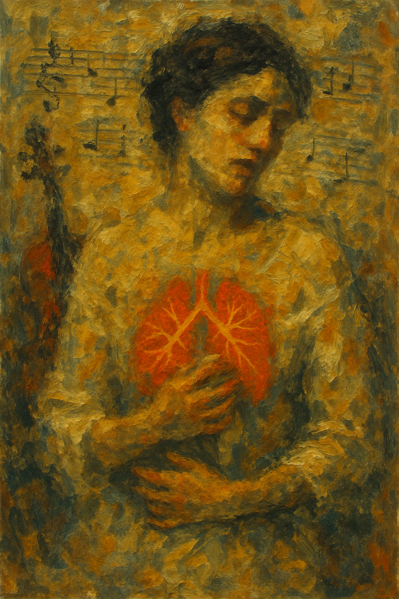

# La Traviata

In particular, the music played at the moment of Violeta's death, the last scene, is very important. Act 3's aria [*Addio del Passato*](https://youtu.be/ug9gWXlyuDs?si=CCD_NZuu_2-vWA8U) ("Barewell to the Past") expresses the scene of Violeta recognizing her imminent death and saying goodbye to loneliness in music.

In "La Traviata", music expresses the disease of tuberculosis in Violletta as a core of her emotions and humanity, rather than just a background setting. Especially in "Addio del Passato", it expresses the weakened body of Violletta and the fading flame of life through a soft and increasingly weak melody. The slow and thin melody implies inner peace as she prepares to leave the world, but at the same time dramatically highlights the transience of human existence and the despair caused by disease. Music goes beyond mere description and conveys to the audience the loneliness, regret, and obsession of love felt by Violeta.

A disease called hearing impairment is depicted in a movie called [*Coda*](han_gahyeon.md). Pulmonary tuberculosis and hearing impairment are not directly related, but hearing impairment is a type of hearing loss and aminoglycoside antibiotics, such as one of the treatments for streptomycin Tuberculosis, can induce this ototoxicity and cause hearing loss.

In her final moments in La Traviata, Violetta uses music to express her profound loneliness and the sorrow of saying goodbye. The aria “Addio, del passato” conveys her emotional and physical decline through its slow tempo and subdued melody. The music reflects her isolation, resignation, and fading hope, becoming a powerful vehicle for her inner voice. Rather than merely accompanying the drama, the music itself becomes her final confession — a poignant farewell to love, life, and the world.

