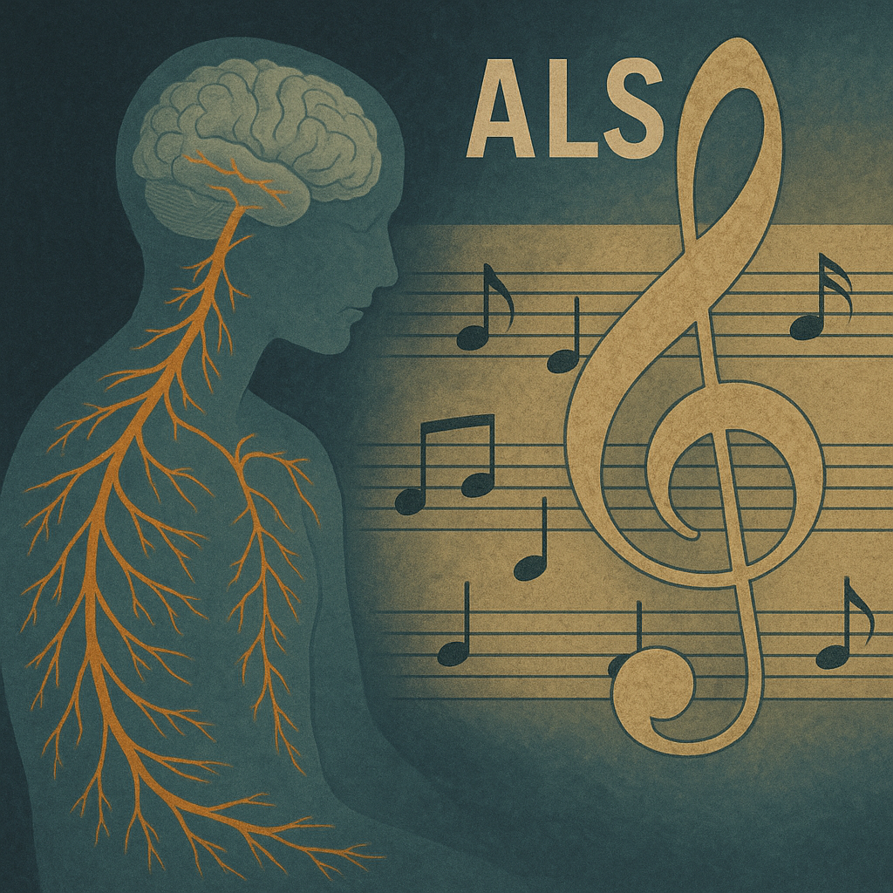

# The Theory of Everything

The music [*The Theory of Everything*](https://youtu.be/nMFUkbr7ymY?si=-FtmRNN__DjKrBJ6) delicately captures Stephen Hawking’s journey in coming to terms with the heavy fate of ALS. In particular, Jóhann Jóhannsson’s score makes extensive use of repeated piano arpeggios and layered string textures, which create a sense of both fragility and resilience. These musical elements effectively illustrate the contrast between physical limitation and mental transcendence, highlighting the human spirit’s triumph over adversity.

The film’s main theme, which features a simple, cyclical piano figure, grows in intensity as more strings are gradually added—symbolizing Hawking’s journey from despair to acceptance. This crescendo mirrors the evolution of his life, showing that even as his body weakened, his mind soared. The music thus functions not merely as background but as a narrative voice that helps the audience experience the struggle and triumph of the human spirit alongside Hawking. This concrete use of musical motifs in key moments helps transform illness from a mere tragedy to a deeply human journey, illustrating how music shapes our understanding of suffering and resilience.

This film [*To kill a Mockingbird*](ha_jeonghyeon.md) does not deal with ALS, but it deals with physical disorders, but it is confirmed that it is a disorder related to the nervous system in common, so the content will also be helpful in dealing with the disease I described.

# 새끼손가락 걸고
저는 제 장례식에 와서 저를 추모해주는 고마운 사람들에게 꼭 다음 만남을 기약하고 싶습니다. 이 노래의 가사 중에는 "언젠가 다시 만날 때 좋은 이야기를 나누자. 기억해 우리 약속해 꼭 다시 만나자."라는 가사가 있습니다. 이미 장례식이 진행되고 있을 때에는 '나'는 존재하지 않지만, 이 노래를 통해 소중한 사람과 다시 만날 날이 있을 거라는 이야기를 전달하고 싶습니다. [*새끼손가락 걸고*](https://youtu.be/NGmL_WouziE?si=cQvPqoC9K5tZLu_A)
