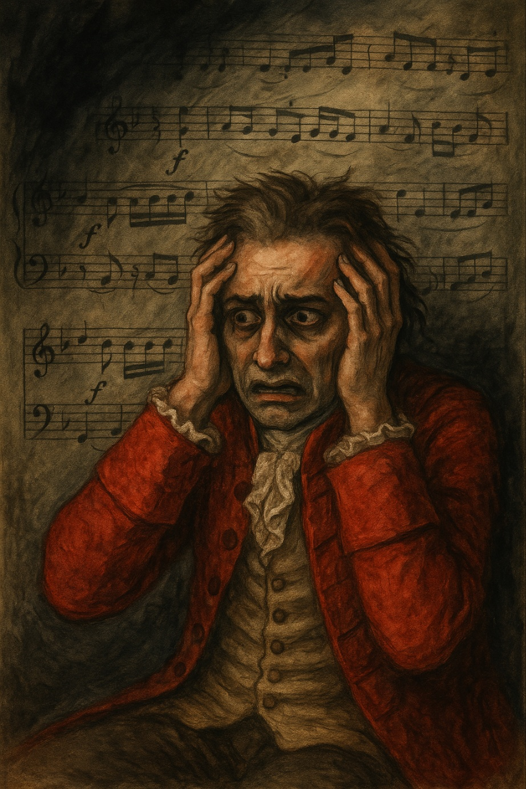

# Amadeus

<<Requiem in D minor, K. 626, Lacrimosa>> symbolically depicts Mozart's weakened soul and spirit. In the film, the piece is used in the incident where Mozart speaks his last words on his sickbed, and the atmosphere of his dislike for music stimulates his sense of collapse and death. The trembling of the instruments expresses his anxious psychological state, and the sorrowful strings of the chorus express the pain of his treatment. From a physics and engineering perspective, the pitch and dynamics of the piece produce the effect of converting human physiological and psychological states into sound wave compression and combination, expanding the phenomenal resonance.

[Mozart falls weak after dictating a few words from "Lakrimosa." The music becomes more intense](https://youtu.be/VixAWkjyhx0?si=4tQ2vl2wl9L4ouYQ), suggesting that his death is imminent. Salieri understands his genius but witnesses the tragedy of losing him. The scene ends with Mozart's death, emphasizing the unfinished state of "Lakrimosa," and the film is converted to the scene of his funeral. Mozart tries to complete the score for "Lakrimosa," but he is unable to compose the song himself due to his physical limitations. He dictates the melody and harmony of the "Lakrimosa" to Salieri, who records it as the score. In the process, the first notes of "Lakrimosa" begin to play. The trembling tone and slow tempo of the strings heighten the tragic atmosphere of the scene.

Example: It's not exactly the same disease, but a similar disease is depicted in Mamoru Hosoda's 2021 musical [Belle: The Dragon and the Freckled Princess](huh_yejin.md). The musical is about overcoming trauma through a song called "A Million Miles Away", centering on a woman who suffered the trauma of losing her mother due to a childhood accident.

