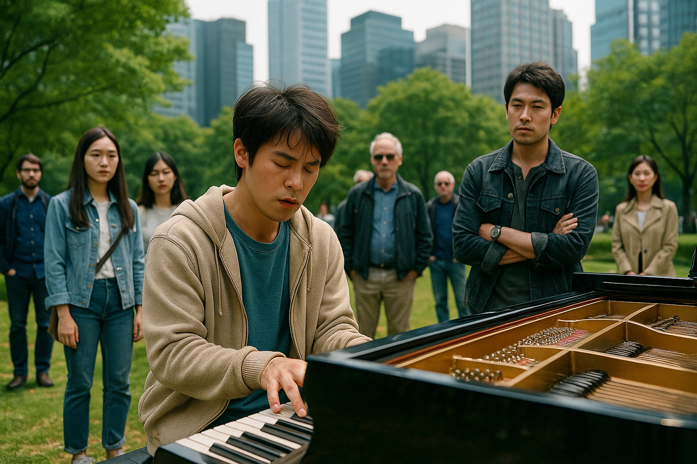

# Keys to the Heart

In "Keys to the Heart," music is not used to highlight Jin-tae's disability as a limitation, but rather to express his rich inner world and emotions. Although Jin-tae struggles with everyday communication due to his autism -at this point, it emphasizes his symptoms, especially difficulties in social relationships-, he is able to convey his feelings clearly through piano performance. The film uses music as a language that transcends verbal communication, portraying Jin-tae not as someone defined by his disability but as an individual with his own profound means of expression. In summary, through music, the movie illustrates that difference does not imply deficiency, and true understanding can happen beyond words.

In the movie, Beethoven's Moonlight Sonata (3rd Movement) is used when Jin-tae first reveals his hidden talent by playing the piano. The piece’s calm and melancholic tone reflects Jin-tae’s isolated inner world and marks the moment when his brother Jo-ha begins to see him in a new light.

I felt a sense of similarity between the work I selected and the storyline of [My Annoying brother](kim_yesung.md) in that both portray “reconciliation between siblings through music.” In both works, music effectively expresses the conflict within the family caused by disability, and the way family members begin to see each other as people—as family—beyond the disability.

[This](https://www.youtube.com/watch?v=uNRvJujw7ws) is the piano performance scene I described from the film.

