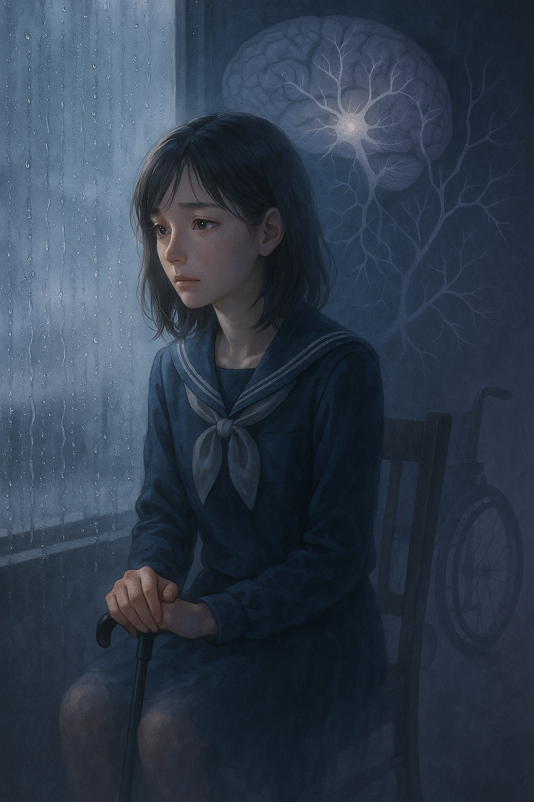

# One Litre of Tears

The theme song of 1 Litre of Tears, [“Only Human” by K](https://www.youtube.com/watch?v=CqsdRNiQOtE), beautifully represents the emotional tone of the series and captures the inner world of the protagonist, Aya Ikeuchi. As Aya gradually loses her physical abilities due to a degenerative disease, the song gently but powerfully expresses her silent determination to continue living as herself. The delicate blend of piano and strings reflects her sorrow, internal conflict, and unwavering will to keep going—leaving a lasting emotional impression on the viewer.

In scenes where the song is featured—whether in the music video or as an insert track—the music complements moments when Aya struggles to express herself in words. Her fear of losing control of her body, her gratitude toward her family, and her private emotions are delicately communicated through music. This allows viewers to go beyond the image of a “sick girl” and connect with Aya as a full, complex human being.

The drama 1 Litre of Tears (2005, Fuji TV) is based on the real diary of Aya Kitō, a girl diagnosed with spinocerebellar degeneration at the age of 15. The series portrays her daily life as she experiences increasing physical limitations, but also highlights her emotional strength, her will to learn and grow, and the deep bonds she shares with family and friends. Rather than focusing solely on her decline, the drama honors her resilience and the richness of her lived experience.

A similar work with a comparable tone and message is [*Extraordinary Attorney Woo*](park_hyowon.md). Through the story of a protagonist with autism spectrum disorder, the drama uses music and thoughtful direction to express emotional depth and complexity. Both works reject the notion of disability as merely tragic, instead highlighting difference as an essential and dignified part of human diversity.

Both Aya and Woo Young-woo fall outside conventional ideas of what is “normal,” but each finds her own way to engage with the world and gently challenge the biases around her. Their stories show that living with illness or disability is not a misfortune, but one of many valid ways of being. These works offer powerful messages about empathy, inclusion, and embracing diversity in human life.

# 나의 장례식 플레이리스트
[Erik Satie – Gymnopédie No. 1](https://www.youtube.com/watch?v=S-Xm7s9eGxU)

저는 술을 좋아하고, 저의 주변 사람들 또한 술과 맛있는 음식을 사랑하는 사람들이 많습니다. 그래서 제 장례식은 단순히 슬픈 자리가 아니라, 맛있는 음식과 술을 즐기며, 제가 사랑했던 분위기 속에서 함께 시간을 보내는 자리가 되었으면 합니다. 특히 저는 외인을 좋아하는데, 외인바에서 나올것 같은 클래식 음악을 틀어두면, 사람들이 저를 기억하며 조용히, 그리고 따뜻하게 미소 지을 수 있지 않을까 생각했습니다. 제가 선택한 곡은부드럽고 고요한 선율로, 그 자리를 편안하고 섬세하게 감싸줄 거라고 생각합니다. 슬픔 속에서도, 제가 좋아했던 사람들끼리 좋은 시간을 보내주기를 바라고, 그게 제가 원하는 마지막 모습입니다.
