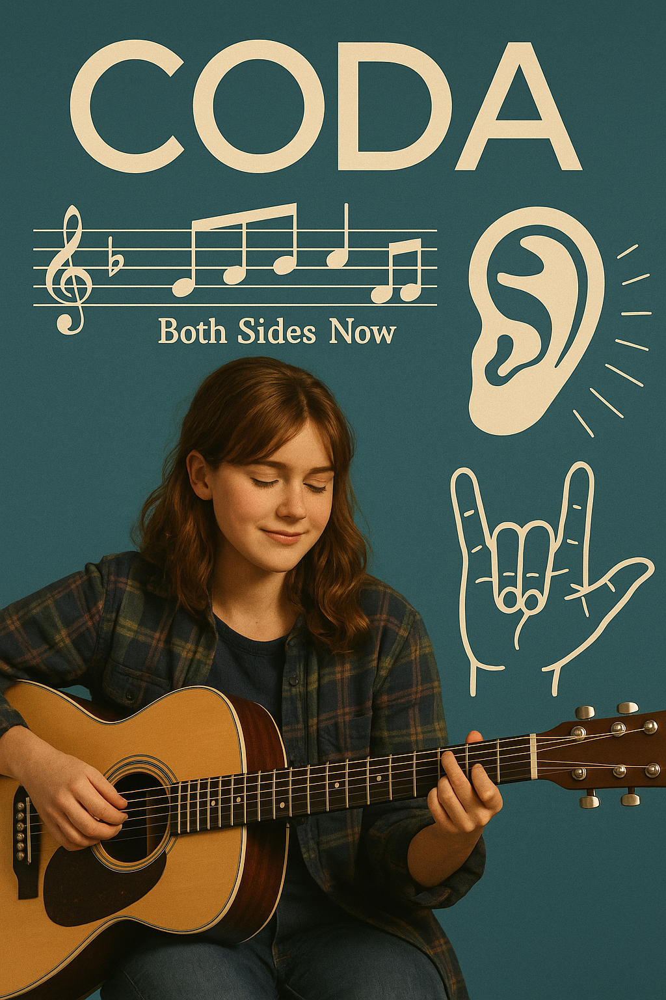

# CODA

In the movie CODA, music is not just an art, but has an important meaning as a tool for self-expression and communication. Ruby, the main character in the deaf family, is the only child with hearing, and has lived as an interpreter for the family for a long time. However, discovering her own voice and dreams through singing, and in conflict between her family's expectations and personal aspirations, she gains the courage to choose for herself through music.

Music also serves as the bridge between Ruby and her family. [In the scene where Ruby performs](https://www.youtube.com/watch?v=1eUSnXQjdg4), the family cannot hear the sound, but they feel the stage with their fingertips and understand their daughter's feelings, and the music connects the family with deeper language of emotions than words. [In the last scene](https://www.youtube.com/watch?v=QUAg5sJEDww), the music "both sides now" symbolizes the confusion, conflict, and growth Ruby experienced, and at the same time represents the moment of her decision to move toward her dream. In this way, CODA shows that music can be a medium of deep empathy and communication that connects people beyond simple sounds.

Example: The same disease is described in Lee Jae-kyoo and Hong Jin-ah’s 2008 drama[Beethoven Virus](park_jinpyo.md). The drama shows Beethoven’s Symphony No. 9.

