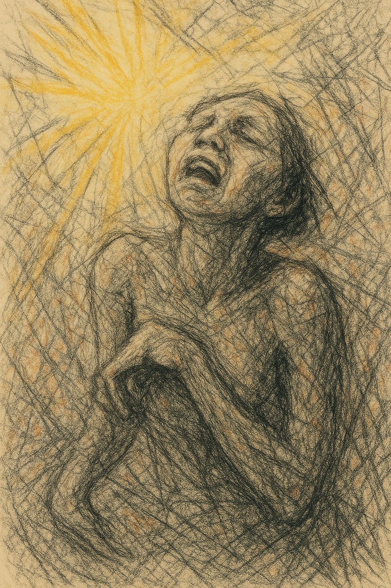

# Oasis

[This song](https://youtu.be/A-75OwC-iiM?si=C6d47AMYwyVnK5FH) reflects the moment Gong-ju comes to terms with her feelings for Jong-du. While on a date, she observes ordinary couples around them and imagines what it would be like to love freely without the burden of her disability. She quietly sings of this longing—envisioning a relationship where she and Jong-du could be just like any other couple.

This song might sound like a simple love ballad. But when heard within the context of the film, it evokes deep, complex emotions—gratitude toward someone who sees her without prejudice, tenderness, and longing. It also highlights the deeper pain of living with a disability—not just the physical limitations, but the emotional wounds caused by the way others look at you, leading to isolation and low self-esteem. The scene and song together leave a lasting impression.

Example: The same disability is described in Robert Mulligan's 1962 film [To Kill a Mockingbird](ha_jeonghyeon.md). The music used in this film, much like Oasis’s “If I” highlights the hardships faced by individuals with physical disabilities due to societal prejudice, emphasizing their vulnerability as marginalized figures. Musically, it delicately and intrinsically expresses the wounds of these fragile individuals, thereby amplifying the sorrow and pain they experience as a result of society’s bias, creating a powerful emotional impact.

