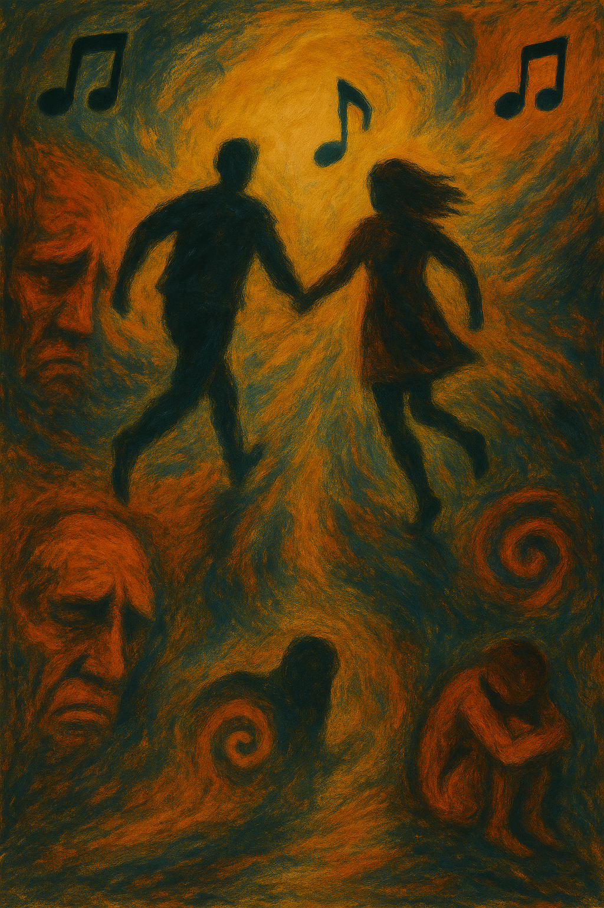

# The_end_of_the_f***ing_world

In The End of the F**ing World (2017-2018), created by Jonathan Entwistle and based on the graphic novel by Charles Forsman, music plays a subtle yet emotionally resonant role, revealing the inner lives of two troubled teenagers who struggle to express themselves. The series blends dark humor and existential loneliness through the story of James (Alex Lawther), a boy who believes he’s a psychopath, and Alyssa (Jessica Barden), a rebellious girl desperate to escape her home life. James’s emotional numbness appears to stem from childhood neglect and a distant relationship with his father, forming the psychological basis for his dissociation from others. Similarly, Alyssa’s defiance and emotional volatility reflect her response to neglect and distrust in her own family.

One striking example of this emotional layering occurs with the use of Graham Coxon’s [“Walking All Day.”](https://www.youtube.com/watch?v=FruHLslczag) The song plays during a quiet moment between the two characters, allowing the viewer to feel the weight of unspoken thoughts and the tenderness that words fail to convey. The track’s melancholic tone and sparse instrumentation mirror James’s internal shift—from numb detachment to a fragile recognition of connection and care. Its slow tempo, repetitive acoustic guitar pattern, and absence of percussive rhythm evoke a sense of stasis and psychological isolation, mirroring James’s emotional paralysis. In this context, music becomes not just background, but a voice for the emotional truths the characters themselves are unable to articulate. This emotional emptiness is central to Antisocial Personality Disorder, and the minimalistic structure of the music reflects James’s inability to access or express deeper emotions. The lyric “I’ve been walking all day” becomes symbolic of James’s emotional journey—silent, aimless, and longing for connection he cannot name.

The same disease Antisocial personality disorder is described in Lynne Ramsay's 2011 film [*We Need to Talk About Kevin*](han_yeonsoo.md).The music used in the film is Buddy Holly's "Everyday", and it similarly conveys the protagonist’s antisocial personality disorder and antisocial traits and emotional coldness through its use. Another shared aspect is that the protagonist is a minor, and their antisocial traits are shown to be connected to their parents.

