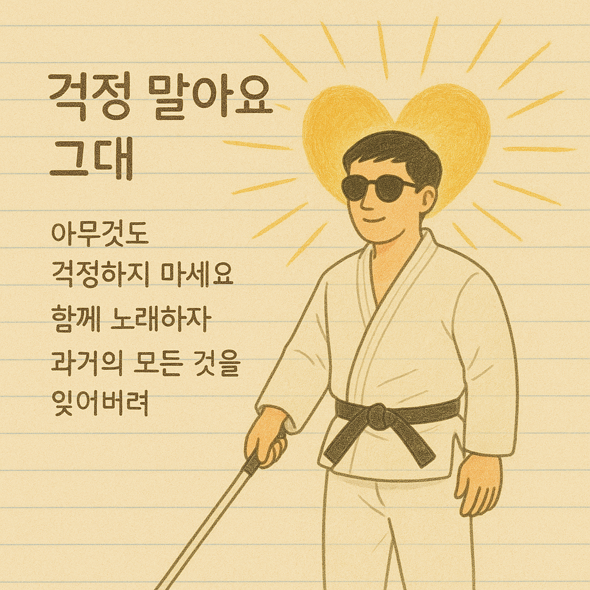

# My annoying brother

Although the lyrics do not directly describe visual impairment itself, they instead gently express the emotions experienced after the onset of disability, such as anxiety, a sense of loss, and ultimately the acceptance and continuation of life. For example, lines like “Don’t worry about anything,” “Let’s sing together,” and “Forget everything from the past” offer comfort to a life shattered by visual impairment and the struggle to overcome it. Rather than explaining the disability or portraying it medically, the song embraces the emotions of those experiencing disability—anxiety, sadness, and hope—through its lyrics.

Another key point is that the entire OST flows in line with the reconciliation between the brothers and the growth of the main character toward the end of the film. Therefore, it conveys a hopeful perspective on life after illness with the atmosphere of [“Everything will be okay now.”](https://youtu.be/C271IWMrvQo?si=ioxZgeQs8xSFISQF)

Example: The same disease is described in Park dongjin’s 19th century korean traditional sounds [*Simcheongga*](ahn_ryeogyeong.md). The korean traditional sounds Park dongjin's pansori hit song “Sim cheong’s Milk-Begging Journey.”

