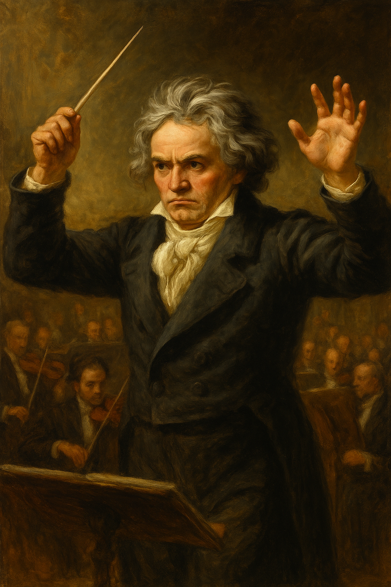

# Beethoven Virus

Beethoven Virus (2008, MBC) is a South Korean television drama centered on music. The story follows Kang Mae (played by Ji Jin-hee), a perfectionist conductor, as he clashes and harmonizes with various amateur musicians. The drama portrays characters who experience physical or psychological illnesses or disabilities, using music as a lens to explore their internal struggles and healing.

The similar condition, psychological trauma, is explored in Shin Bomin’s analysis of David O. Russell’s 2012 film [*Silver Linings Playbook*](shin_bomin.md). The protagonist, who suffers from bipolar disorder, experiences intense emotional responses triggered by music—specifically, My Cherie Amour by Stevie Wonder. This reflects how certain sounds can evoke suppressed emotional pain.

Likewise, [Beethoven Virus portrays characters dealing with hearing loss and deep psychological wounds.](https://youtu.be/cep8Ru4TL4k?si=RJ6CZzAS0lDtlUtG) Beethoven’s Symphony No. 9 acts as a powerful emotional medium, helping the characters confront their inner turmoil and find healing through music. Both works highlight how music can uncover buried trauma and serve as a path toward emotional restoration. 

# 나의 장례식에서 연주되길 희망하는 음악
[Travis Scott - FE!N ft. Playboi Carti](https://www.youtube.com/watch?v=B9synWjqBn8):"FE!N"은 무거운 슬픔에 잠기기보다, 생전의 나를 강렬하게 기억해달라는 의지가 담긴 곡입니다. 반복되는 비트와 폭발적인 에너지는 단순한 추모를 넘어 삶에 대한 강렬한 존재감, 나만의 리듬으로 살아온 흔적을 강조하죠. 조용한 슬픔이 아닌, 내가 어떤 사람이었는지를 잊지 말고 기억해달라는 메시지를 담고 싶었습니다.
# 가상인물의 질환서사
이선후의 이야기[(플레이리스트)](https://www.youtube.com/watch?v=kdUe1xZh9N0&list=PLEYYTr57FRIJmjQzuWU-VwSna9SyTONxG&index=1)
이선후는 늘 ‘괜찮다’고 말했다. 아파도, 힘들어도, 울고 싶어도.
주변 사람들은 그런 그를 '강한 사람'이라고 불렀고, 그는 그 말에 자신을 꾹 눌러 담았다.

하지만 어느 순간부터였을까.
사람들 사이에 있어도 마음이 외로웠고, 눈앞의 일에 아무런 감정이 들지 않았다.
아침에 눈을 떠도 하루가 시작된다는 사실이 무거운 짐처럼 느껴졌고, 거울 속 자신은 마치 남처럼 낯설었다.

“나는 왜 이렇게까지 살아야 하지?”
입 밖으로 꺼내본 적 없는 이 질문이 가슴속에서 계속 웅얼거렸다.
눈물은 점점 나오지 않았고, 웃음도 어디론가 사라져버렸다.

이선후는 자신이 점점 투명해지는 기분이 들었다.
사람들은 여전히 그의 '괜찮다'는 말만 믿었고, 그의 마음속 무너짐은 아무도 몰랐다.
그래서 더 말하지 못했다. 말해봤자 이해받지 못할 거라 확신했기 때문이다.

그리고 그는 조용히 혼잣말을 했다.
"나는, 대체 언제부터 나를 잃어버렸을까."
