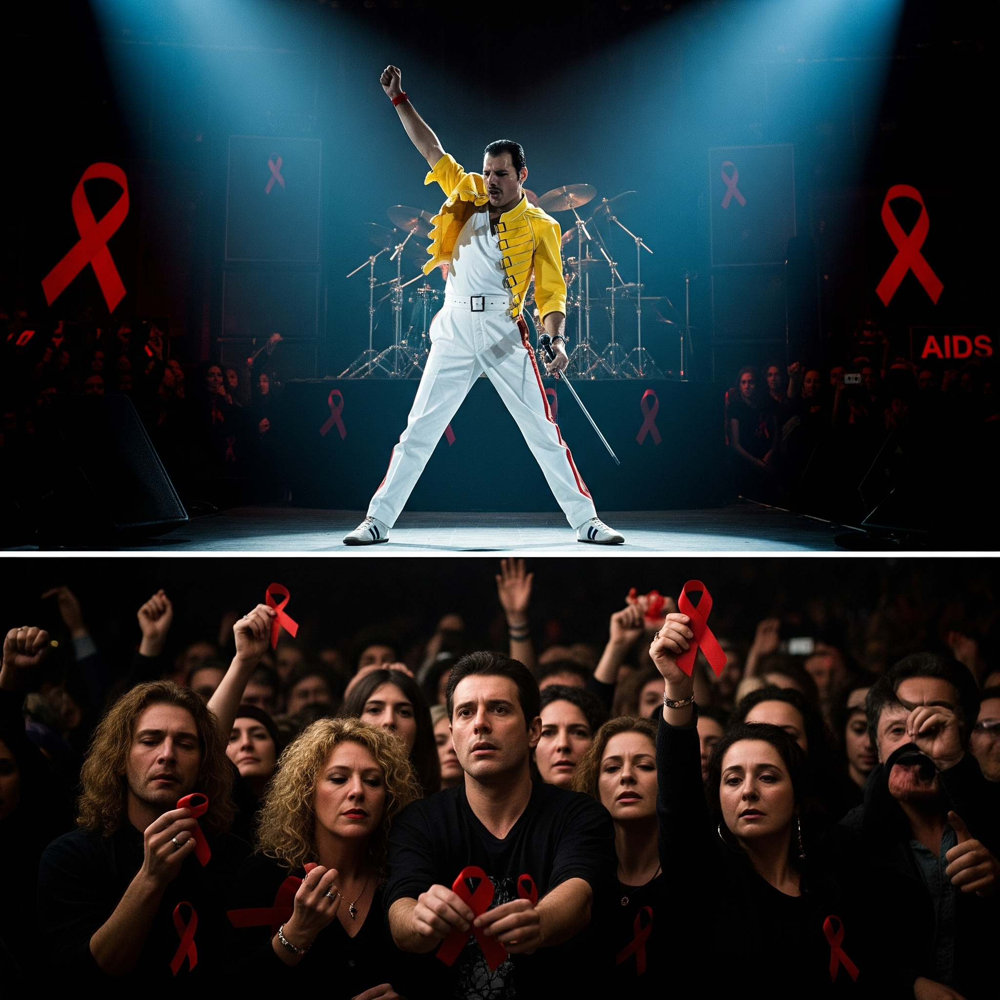

# Bohemian Rhapsody

"[*The Show Must Go On*](https://www.youtube.com/watch?v=36ncula-IDw)" was worked on by Freddie Mercury during his dying period from AIDS, so the voice and lyrics of the song contain Freddie Mercury's desperation. In the film, the song was inserted into the ending credits after live-aid's grand performance, showing the desperation and passion of him, who was suffering from physical pain and weakness caused by AIDS. As for the lyrics, "Inside my heart is breaking, my makeup may be flaking, but my smile still stays on," shows how, even as his body deteriorated, he fiercely preserved his dignity as an artist. And the high pitch with a powerful voice portrays the struggle to transform the despair brought by illness into art while hiding the pain. Through this song, Freddie left behind a testament to his unwavering commitment to music and life even in the face of death.

The same disease, in [the same film](kwak_junyeong.md), is described with different music named "Bohemian Rhapsody". In this writing, AIDS is described through Freddie Mercury's performance 'Live Aid'.

Park Sang Young's 2024 film [*Love in the Big City*](yum_jihyeon.md) also describes HIV infection. Through SURAN's music "Erotic Joke", the writing deals with the social suffering of HIV.

# 장례식에서 연주되길 희망하는 음악: *Bach Cello Suite No. 1 in G Major*

나와 나를 찾아준 사람들에 어울리는 곡이라 생각해 음악으로 "[*Bach Cello Suite No. 1 in G Major*](https://www.youtube.com/watch?v=cGnZHIY_hoQ)"를 선택했다. 밤에 잠을 잘 때 종종 머리맡에 이 곡을 틀어놓고 잠에 들곤 한다. 화려하거나 과장되지 않아 평온하고 명상적인 분위기를 전해주는 음악이 마음에 들었다. 보통 도입부 Prelude가 끝나갈 때 즈음 잠에 드는데, 고요하면서도 따뜻한 선율이 고조되다가 조용히 사그라지는 구조에서 잠들기 전 마음이 차분해지는 느낌을 받고는 했다. 죽음을 흔히 '영면(永眠)'이라 표현한다. 오랜 시간 함께 잠에 든 음악인 만큼 마지막 잠에 들 때도 함께 하고싶다는 생각이 들었다. 또 장례식에 대해 아주 깊게 생각해본 적은 없지만, 한 가지, 내 영정사진 만큼은 활짝 웃고 있는 얼굴로 하리라 생각했다. 나를 찾은 사람들이 이별로 인한 슬픔보다는 좋은 기억을 떠올리며 돌아가기를 바라는 마음이다. 이런 의미에서 장례식 음악으로 슬프거나 너무 웅장한 음악보다는 편안하고 따뜻함을 전해주는 음악이 적합할 것이라 생각하는데, 해당 음악이 이에 굉장히 잘 어울린다고 생각한다. 기본적으로 장조의 선율에 과장되지 않은 평온함과 따뜻함을 전하는 만큼 음악은 고인에 대한 좋은 기억을 더 많이 떠올리도록 한다. 정말 그렇게만 된다면, 고인도 더 편안히 눈을 감을 것이다.
