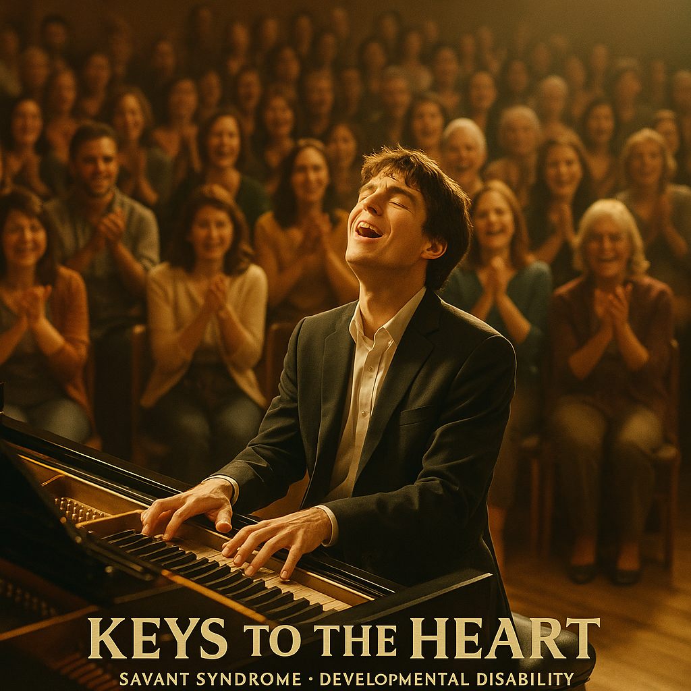

# Keys to the Heart

Savant Syndrome refers to a condition in which individuals with intellectual or developmental disabilities exhibit remarkable abilities in specific areas. In the film Keys to the Heart, the protagonist Jin-tae is a young man with developmental disabilities who struggles with communication and daily interactions. However, when he sits in front of a piano, he reveals a level of musical genius that surprises everyone around him. The film follows his emotional journey as he reconnects with his older brother after years of separation and begins to express his identity and emotions through music.

[In one of the film's most memorable scenes](https://youtu.be/fLt6uvYrxRk?si=J60Kcz7gmK--xaYv), Jin-tae plays Tchaikovsky's Piano Concerto No.1 Bb minor Op.23. Savant Syndrome refers to a condition in which individuals with intellectual or developmental disabilities exhibit remarkable abilities in specific areas. In the film Keys to the Heart, the protagonist Jin-tae is a young man with developmental disabilities who struggles with communication and daily interactions. However, when he sits in front of a piano, he reveals a level of musical genius that surprises everyone around him. The film follows his emotional journey as he reconnects with his older brother after years of separation and begins to express his identity and emotions through music. His performance of Tchaikovsky’s Piano Concerto No. 1, a technically and emotionally demanding piece, powerfully illustrates his savant abilities by showing how his extraordinary musical talent exists in contrast to his everyday challenges.

Autism, a type of developmental disorder, is depicted in Yoon-chul Chung’s 2005 film [*Marathon*](kim_taehyeong.md). The song “Run, Cho-won” featured in the movie effectively reflects the protagonist’s repetitive and routine-based life. Just as the main character in the film Keys to the Heart, which I wrote about, shows talent in playing the piano, the protagonist of Marathon also demonstrates great talent—specifically in running.

