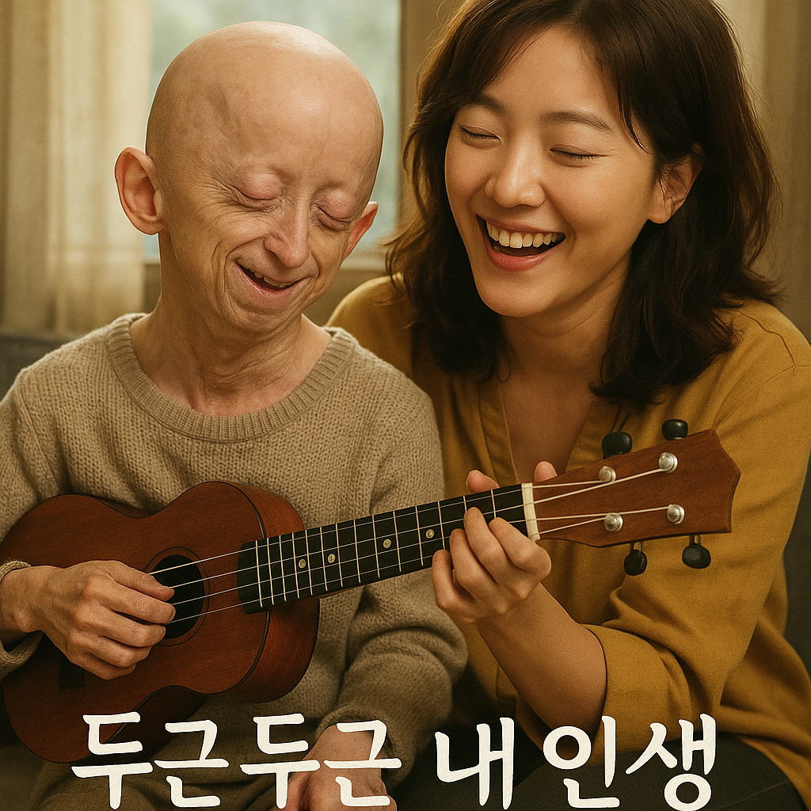

# My brilliant life

[*My Brilliant Life*](https://www.youtube.com/watch?v=f4HFSlYNujk) does not use music to dramatize illness, but rather to quietly illuminate the beauty and fragility of life. In the film, the music gently supports Ah-reum’s story without overshadowing it. The calm melodies, especially those used in moments of reflection, emphasize the protagonist’s emotional depth and the preciousness of each moment he lives.

For instance, in the scene where Ah-reum sees the ocean for the first time—a lifelong dream—the soft piano and delicate string arrangement of Song For Life plays in the background. As Ah-reum gazes out at the vast sea, the music reflects his wonder and peace. This moment, accompanied by the gentle score, highlights his humanity, not his illness. The music allows the audience to connect with his dreams, reinforcing the film’s message: that a meaningful life is not defined by length, but by emotional richness.

A similar approach can be seen in [*Daily Dose of Sunshine*](yoon_soi.md), where Gymnopédie No.1 softly accompanies the main character Daeun and the patients she cares for. The music there also avoids dramatization. Instead, it acknowledges mental health as a part of life and creates space for empathy.

Both works use quiet, contemplative music not to evoke pity, but to shift the focus toward the emotional world of individuals living with illness. Through this, they reject the binary of “normal” versus “abnormal” and instead present a more inclusive, humanistic view of life.

나는 내 장례식 음악으로 드뷔시의 [*'아라베스크 1번'*](https://www.youtube.com/watch?v=jiKb-JzJFQM)을 틀 것이다. 드뷔시의 노래는 너무 슬프지도, 너무 기쁘지도 않다. 특히 이 '아라베스크 1번'은 고귀하고 고풍스러운 느낌까지 준다. 나에게 죽음이란 아주 슬픈 것도, 기쁜 것도 아니다. 그저 인간이라면 모두 맞이하는 것이기에 나의 마지막을 아름답게 장식할만한 노래로 이 노래를 선정했다.
