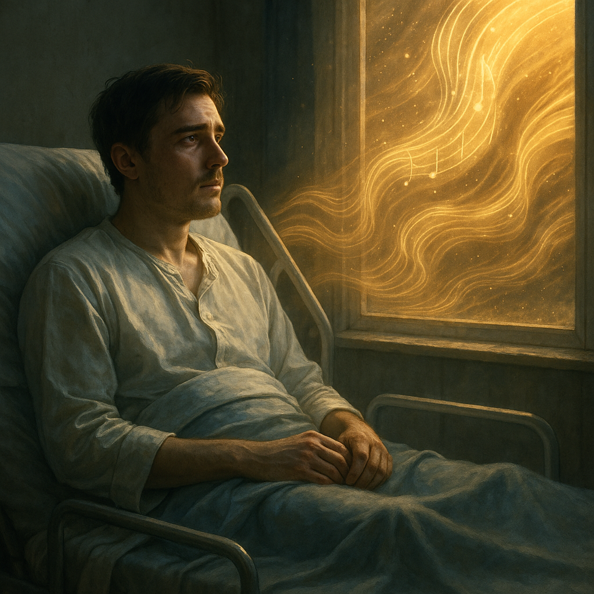

# The Fall

[Beethoven's *Symphony No. 7, 2nd movement*](https://youtu.be/Urv9aruTups?si=SoZgX20_iMUX2C_B) symbolizes his physical disability and helplessness through its slow, repetitive rhythms. Beethoven composed this piece after he had become almost completely deaf—a devastating loss for a composer, which plunged him into isolation and despair. The persistent, mournful rhythm reflects the weight of his condition, while the hauntingly beautiful melodies express the emotional turbulence of a man grappling with the loss of a core part of his identity. Yet, within the melancholy, there is also a sense of defiance and yearning for transcendence.
Similarly, in The Fall, the protagonist Roy is a stuntman who suffers a spinal injury that leaves him paralyzed from the waist down. Once full of vitality and purpose, Roy is now bedridden, emotionally broken, and struggling with the loss of control over his life and body. His sense of helplessness is not only physical but also deeply psychological—he feels abandoned, purposeless, and suicidal. The music reflects his inner turmoil: the slow tempo mirrors the stagnation of his current life, and the intense crescendos symbolize the emotional storms within him. Roy’s elaborate fantasy stories, which he tells to a young girl named Alexandria, serve as an escape from his grim reality and a subconscious attempt at healing.
Through Beethoven's music, the film emotionally underscores Roy's suffering and his desire to reclaim agency in a life that seems hopeless. It conveys his disability not just as a medical condition, but as a deeply layered emotional and existential crisis. Ultimately, the music becomes a voice for his silent struggle—a journey through despair, imagination, and the fragile hope of emotional recovery.

Example: The similar disease(paralysis) is described in Olivier Nakache 2011 film [*The Intouchables*](kim_naeun.md). The piano music *'Una Martina'* of "The Intouchables" depicts the protagonist's physical disability in three dimensions, similar to the symphony of "The Fall". Both songs have similar atmospheres that reveal the bitter and empty heart of the protagonist and at the same time give hope in the heart.

