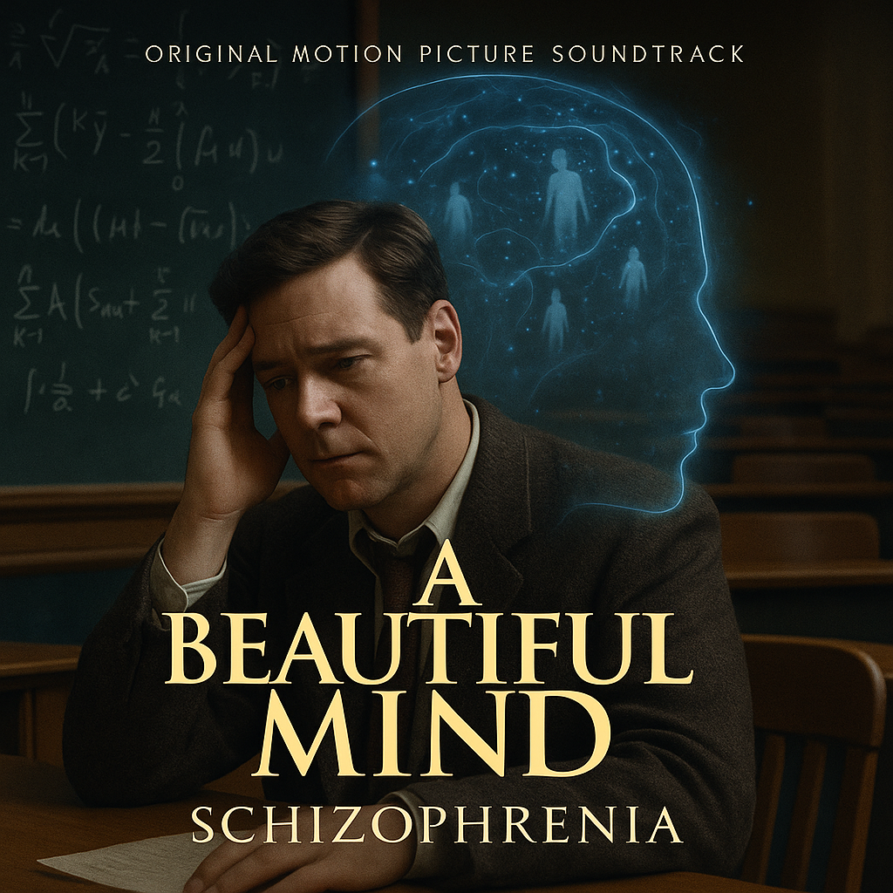

# A Beautiful Mind

[In A Beautiful Mind](https://youtu.be/kG4MKyq6jOU?si=HheQ8m3hP7tE_Uny), James Horner’s music serves as a crucial tool in portraying John Nash’s schizophrenia. The score delicately reflects Nash’s complex mental state, using sharp, chaotic melodies during moments of confusion and tension, while employing serene and graceful tunes to capture moments of peace and hope. The music goes beyond the background, emotionally unfolding Nash’s inner turmoil and his struggle with the illness, playing a pivotal role in expressing his journey toward recovery.

Example: The same disease is described in Davinci’s 2014 drama [*It’s Okay, That’s Love*](do_gwanwoo.md). The drama Davinci’s hit song “It’s Okay, That’s Love.”

아이유,[밤편지](https://youtu.be/BzYnNdJhZQw?si=XJCwmEAfTEtjhGG2)
밤편지는 마치 고인에게 마지막으로 조용히 전하는 마음속 편지처럼 느껴지는 곡입니다. 곡 전반에 걸쳐 흐르는 분위기는 매우 잔잔하고 따뜻하지만, 동시에 애틋하고 아련한 감정이 섞여 있습니다. 이 노래는 슬픔을 소리 높여 외치기보다는, 곁에 있는 듯 말없이 곁을 지키는 감정을 담고 있어, 장례식처럼 조용히 감정을 나누는 자리에서 매우 적절하게 어울립니다.
