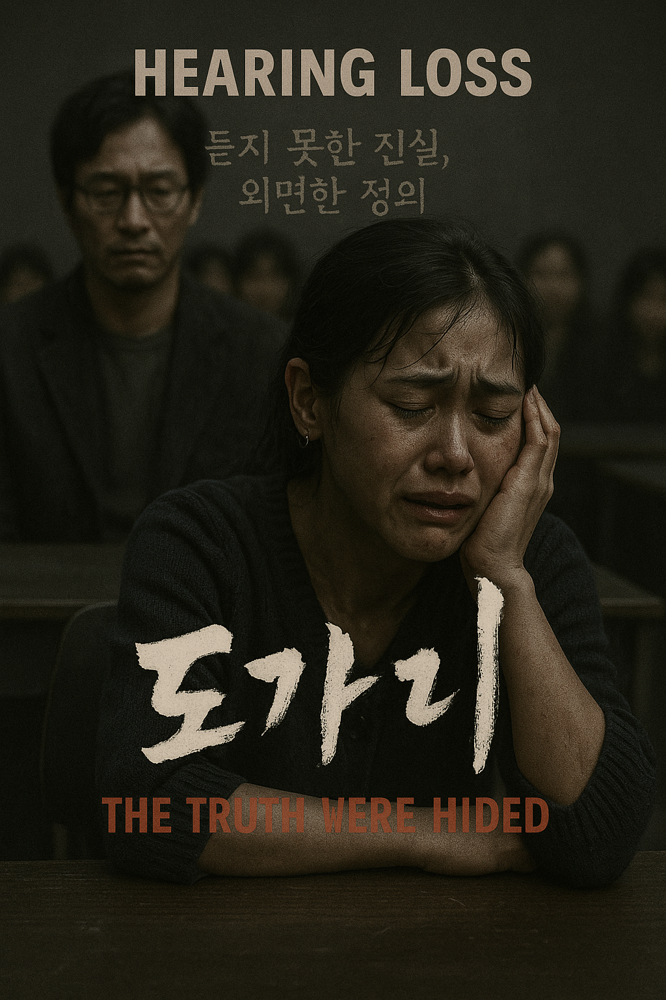

# Silenced

The main theme of the film Silenced ("The Crucible"), composed by Mowg, plays a crucial role in shaping the emotional depth and message of the story. The piece “The Truth Were Hided” employs a slow, somber string melody that mirrors the pain and helplessness experienced by the hearing-impaired children who are victims of abuse. Rather than dramatizing these emotions, the music adopts a restrained emotional tone—a minimalist style marked by sustained cello notes, sparse piano chords, and moments of silence. This subtle musical approach deepens the audience’s emotional engagement without overwhelming the visual storytelling.

This restrained musical style is particularly effective in scenes such as the teacher’s discovery of abuse, the court’s unjust verdict and the moment when Yeondu, a deaf witness, testifies that she heard faint music and saw her friend being sexually assaulted, [a claim later verified by the court through an auditory experiment](./https://www.youtube.com/watch?v=p-bORDug8lY). In these moments, the subdued score—marked by soft cello harmonies and intentional silence—mirrors the gravity of the injustice and the silence of society. By avoiding emotional exaggeration, the music preserves the victims’ dignity and intensifies the audience’s sense of outrage and empathy. Ultimately, Mowg’s minimalist composition becomes a powerful narrative tool, reinforcing the film’s call for awareness and accountability without relying on words.

Same disease in Naoko yamada's animated movies [A Silent Voice](lim_seokhyeon.md), features the instrumental track “Lit” composed by Kensuke Ushio. A similar approach is used in A Silent Voice, where Kensuke Ushio incorporates ambient noise and delicate piano melodies to express the emotional isolation of hearing impairment. This technique deepens audience empathy by recreating the auditory experience of a hearing aid user.

