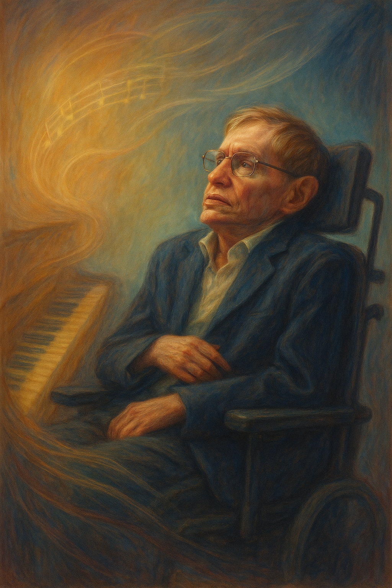

# The Theory of Everything

[Jóhannsson’s music uses gentle piano motifs and swelling strings to evoke both the vulnerability and inner strength of Hawking as he faces physical decline.](https://youtu.be/ZbJZ5kU4w5c?si=ftKN8lgXHnIxEpD2)The score’s hopeful yet melancholic tone mirrors the persistence of intellect and love despite the progression of disease, allowing the audience to feel both the sorrow and inspiration in Hawking’s story.

As the film unfolds, Hawking’s illness progresses gradually and is depicted in detail: it begins with subtle signs such as a slight limp and trembling hands, then develops into increasing difficulty with movement and coordination. Everyday tasks—like climbing stairs or holding a pen—become challenging, and eventually, Hawking must rely on a wheelchair for mobility and loses his ability to speak. These physical changes are not only shown visually but are also underscored by shifts in the music, which grows more introspective and somber during moments of loss, yet swells with hope and warmth when Hawking finds support from loved ones or achieves scientific breakthroughs. Through this careful alignment of music and narrative, the audience is invited to experience both the hardships and the resilience that define Hawking’s journey.

Specifically, the use of gentle, repetitive piano motifs during difficult times highlights Hawking’s vulnerability, while the gradual introduction of strings and more complex harmonies during positive moments emphasizes resilience and connection. Through these musical techniques, the audience is invited to experience both the hardships and the resilience that define Hawking’s journey. 

Gentle piano refers to a musical technique where soft and delicate piano melodies are used to convey deep emotions and atmosphere through simplicity and subtlety.
This gentle piano style is prominently featured in both The Theory of Everything and [*Untouchable*](heo_taeyoung.md), expressing the characters’ vulnerability, inner strength, and the beauty of life with sensitivity.
In [*Untouchable*](heo_taeyoung.md), Ludovico Einaudi’s “Fly” is a prime example, using gentle piano to warmly and hopefully depict moments when the protagonists forget about disability and fully enjoy their sense of freedom.

---

저의 장례식에 틀어졌으면 하는 음악은 [' Tyler, The Creator - ARE WE STILL FRIENDS? '](https://www.youtube.com/watch?v=VMFJwSR1MQQ&ab_channel=MinimalSounds)입니다.
저와 친했던 모든 사람들에게 영원히 친구로 남았으면 하는 마음으로 선택하게 되었습니다. 
